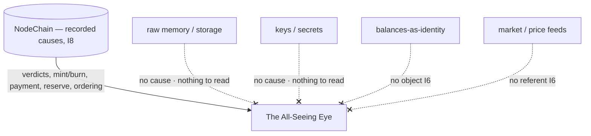

# Observation Scope and Limits

**Stands on:** I7 (observe and VETO, never initiate), I8 (append-only causality), I5 (determinism), I6 (no speculative surface). See `README.md` §1.

## 1. Purpose

This document fixes **exactly what the Eye observes** and **what has no object for it to observe.** Scope is not a policy choice — it is a consequence: the Eye reads precisely the recorded causes it must read to test I1–I6 in the pre-acknowledgement window (I8), and nothing that would let it become a second discretionary actor (I1, I5).

---

## 2. Observation scope — what the Eye reads

The Eye reads **recorded causes from NodeChain** (I8). Because I8 appends every cause before its effect is acknowledged, the complete causal input to every step is already on NodeChain by the time the Eye must judge it — so the Eye needs no access to live memory, storage, or keys to see everything that matters.

| Domain | Recorded causes the Eye reads | Invariant tested |
| --- | --- | --- |
| Processing / PoT | Verdict records, `verified` per `processId`, epoch boundaries | I1 |
| Coin Engine — mint/burn | `emission.minted { processId, minted }`, `emission.burned { processId, burned }` | I1, I2 |
| Coin Engine — payment | Node payment credits, retention markers, their preceding verdicts | I3 |
| Reserve | `reserve.accrual`, `reserveIndex` and its `totalProcessVolume` input | I4 |
| Ordering | The append order of causes vs. effects on NodeChain | I5, I8 |
| Governance oversight | Role-based committee parameter decisions and their bounds | I3, I6 |

Everything in this table is a *recorded cause*, already immutable on NodeChain (I8). The Eye reads derived, canonical records — never raw execution internals.

---

## 3. Observation limits — what has no object for the Eye

These are not "forbidden zones" the Eye is told to avoid; they are things that are **not causes on NodeChain**, and therefore have no object for an observer whose whole function is to read recorded causes.

- **Raw memory, storage layout, call stacks.** Not causes — they are transient implementation state. Because I5 makes every effect reproducible from *recorded canonical inputs*, the Eye never needs transient state to test an invariant; reading it would add nothing and could not change a verdict.
- **Keys, secrets, authentication payloads.** Not economic causes. The Eye tests I1–I6, none of which is a function of a secret; and holding a secret cannot help an actor whose only write is a veto (I7).
- **User identifiers, balances-as-identity, address histories.** ARO has no speculative surface (I6): a held balance confers no power, so a holder's identity is not a cause of any lawful step and is nothing for the Eye to observe.
- **Any "market" datum — price feeds, order books, external quotes.** ARO has no market price (I6); such data has no referent in the model, so there is no object to observe.

*Because* the Eye's only write is a veto (I7), granting it broader read access could never let it *do* more — a veto is a veto regardless of what else it saw. So scope is set to exactly what tests the invariants, and no wider.

---

## 4. Why the scope is complete despite the limits

A reader might worry that excluding raw state leaves the Eye blind. It does not, and the reason is I8 together with I5:

- **I8** guarantees that *every* cause is on NodeChain *before* its effect — so no lawful step can occur whose cause the Eye has not already seen.
- **I5** guarantees that the effect is fully determined by those recorded causes — so nothing outside NodeChain can change what the effect must be.

*Therefore* reading NodeChain's recorded causes is not a partial view; it is the *whole* causal picture. The Eye is all-seeing precisely because I8 puts everything it must see in one append-only place before it takes effect.

---

## 5. Scope is fixed, not expandable by discretion

The observation scope cannot be widened by any single authority, because that would reintroduce discretion the invariants exclude.

- A change to what the Eye reads is a **role-based AI committee** decision (see `README.md` §5), recorded on NodeChain before effect (I8) and reproducible (I5).
- No such change may grant the Eye an economic primitive — that is barred absolutely by I7, independent of any committee.
- No held ARO balance can authorize a scope change, because a held balance confers no power (I6).

Until such a recorded change exists, the Eye reads exactly the causes in §2.

---

## 6. Summary

The Eye is **all-seeing over recorded causes** (I8) and blind to nothing that determines a lawful effect (I5). What it does not read is not hidden from it — it simply is not a cause, and so is not an object of observation. Scope is derivation, not permission.
</content>
