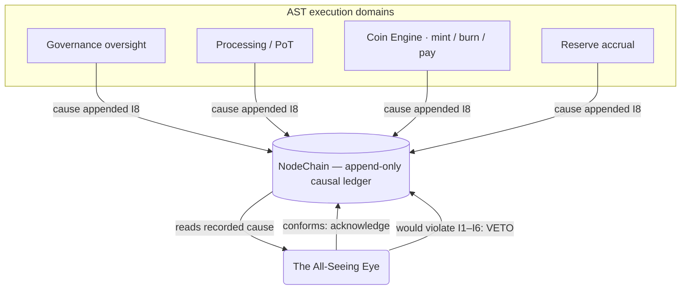

# The All-Seeing Eye — Overview

**Stands on:** I7 (observe and VETO, never initiate), I8 (append-only causality), and enforces I1–I6. See `README.md` §1.

## 1. Purpose

This document defines **The All-Seeing Eye**: the meta-observation system that watches every step of every AST cycle and **can veto (halt) any step that would violate an invariant, while initiating nothing.** It exists so that a system with no privileged issuer (I1, I5) still has a guarantee that no unlawful effect is ever acknowledged.

The Eye is **not** a passive witness. *Because* I7 grants it a veto, and *because* I8 gives it a window in which to use that veto before any effect is acknowledged, the Eye is an active integrity guard. Its activity is exhausted by one verb: **stop**. It never mints, never burns, never pays, never proposes, and never votes — those would each be a new cause of value, which I1 and I5 forbid to any actor but a PoT verdict.

---

## 2. Architectural position

The Eye sits *across* every execution domain, not inside any one of them. It reads the recorded cause of each step from NodeChain and, in the pre-acknowledgement window guaranteed by I8, either lets the step's effect be acknowledged or vetoes it.

- The Eye **initiates no economic state** — it has no mint, burn, or payment primitive (I7).
- The Eye reads the recorded cause of every step from NodeChain (I8) and evaluates it against I1–I6.
- Its only write is a **veto** or an **integrity signal**, each itself appended as a cause (I8) — see `meta_event_logging_protocol.md`.

*Because* the Eye writes only vetoes and signals, and never an economic cause, its presence cannot create a unit of ARO (I1) or a non-reproducible movement (I5). This is what makes an all-seeing observer safe to grant a veto.

---

## 3. Key principles

Each principle is derived from an invariant, not asserted.

| Principle | Derivation |
| --- | --- |
| Total observation | The Eye sees the recorded cause of **every** step, because I8 requires every cause to be appended before its effect — so nothing takes effect unseen. |
| Real veto, strictly negative | The Eye can halt any step that would violate I1–I6 (I7), but has no primitive to author a mint, burn, or payment — its power is negative because I1/I5 admit no second issuer. |
| Pre-effect timing | The veto is decisive because it lands in the window I8 opens between "cause recorded" and "effect acknowledged." |
| Non-repudiable record | Every observation and veto is appended to NodeChain and is reproducible (I5, I8), so the Eye's own conduct is auditable. |

---

## 4. Why the Eye exists

The Eye is the structural answer to a structural risk.

- **The risk.** AST admits no privileged issuer: a unit exists only from a PoT verdict (I1), and every movement must be reproducible (I5). But a step can still be *malformed* — a mint whose verdict is missing, a burn that does not mirror its mint, a payment before confirmation, a reserve movement outside its derivation.
- **Why runtime actors cannot self-guard alone.** Each execution domain records its own cause (I8) but does not have the whole picture; a violation can be visible only when a step is read against all of I1–I6 at once.
- **Therefore the Eye.** A single observer, standing across all domains, evaluates each recorded cause against every invariant in the I8 window and vetoes any that would violate one. It needs no economic power to do this — only sight (I8) and the power to withhold acknowledgement (I7).

---

## 5. What the Eye is not — as concepts with no object here

These are not "restrictions"; they are things that have **no object** in the Eye's construction, each because of an invariant.

- **Not an issuer.** There is no Eye-initiated mint, burn, or payment, because I1 gives a unit exactly one cause (a PoT verdict) and I5 forbids a discretionary second cause.
- **Not a corrector.** The Eye never "fixes" a bad step by substituting a good one. A veto is a *stop*, not a replacement — a substitution would be an authored economic cause, forbidden by I7.
- **Not a voter or proposer.** The Eye casts no vote and proposes no parameter. Governance is role-based AI committees (see `README.md` §5); the Eye only vetoes their output when it would violate an invariant. A held balance confers no vote to anyone (I6), and the Eye holds nothing.
- **Not a passive witness.** The obsolete framing of the Eye as "witness, not judge / no veto / signals only" is void. Under canon the Eye **has** the veto (I7); withholding acknowledgement is its defining act.

---

## 6. Integration outline

| Domain observed | What the Eye reads (from NodeChain, I8) | What a violation triggers |
| --- | --- | --- |
| Processing / PoT | Verdict records, `verified` flags per process | VETO of a mint whose verdict is absent or `≠ 1` (I1) |
| Coin Engine | `emission.minted`, `emission.burned`, payment credits | VETO of asymmetric burn (I2) or payment without confirmation (I3) |
| Reserve | `reserve.accrual`, `reserveIndex` inputs | VETO of a reserve movement outside confirmed-volume derivation (I4) |
| Governance oversight | Role-based committee parameter decisions | VETO of a bounded-parameter change that would violate an invariant (I3, I6) |

All reads are of *recorded causes* on NodeChain — never of raw memory, keys, or private state (see `observation_scope_and_limits.md`).

---

## 7. Next documents

- Scope and limits — `observation_scope_and_limits.md`
- Detection (the recognition function behind each veto) — `anomaly_detection_patterns.md`
- Logging of observations and vetoes — `meta_event_logging_protocol.md`
- The Eye's outputs (vetoes and integrity signals) — `integrity_signal_emission.md`
- Read-only observer nodes — `observer_node_interface.md`
</content>
