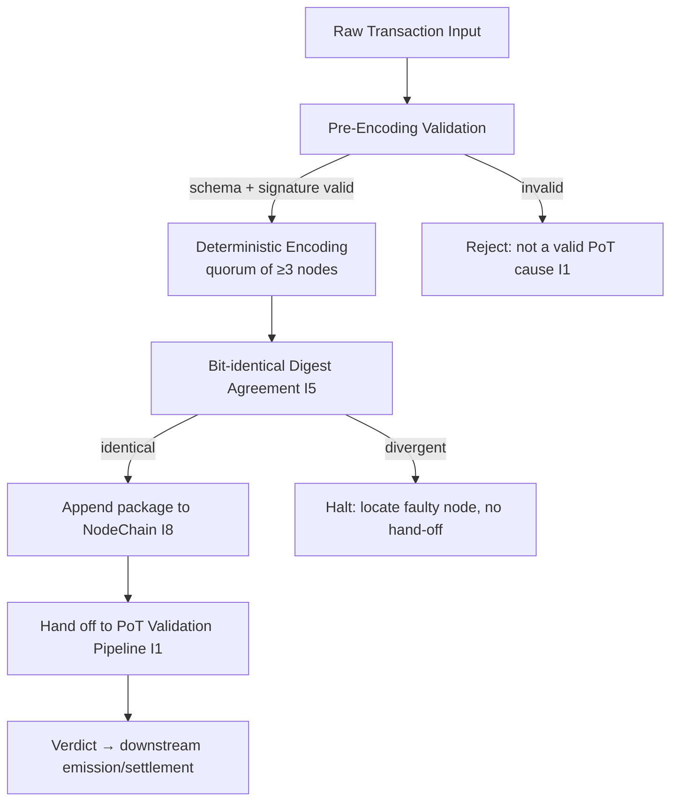

# Decentralized Transaction Encoding

**Module:** AST — Aros Studio Tokenomics
**Component:** Decentralized Transaction Encoding (DTE)
**Stands on:** I1 (PoT-gated origin), I5 (determinism), I6 (no speculative surface), I7 (Eye veto), I8 (append-only causality). See `01_coin_engine/README.md` §1.

---

## 1. Purpose and scope

DTE transforms a raw transaction into a **single canonical binary package** — the exact object the PoT pipeline confirms and NodeChain records. The layer exists to satisfy one demand made by the invariants: PoT must be able to reach the *same* verdict on every node (I5), which is impossible unless the object it confirms is *the same* on every node. DTE is the mechanism that makes a transaction's on-chain form single-valued.

DTE causes no unit of ARO. It precedes emission: it prepares the cause that a later PoT verdict may act on (I1). Nothing in this module mints, burns, or pays.

**Derived goals (each from an invariant):**

- **One encoding, not many** — the encoding is a pure function of canonical inputs, so all honest nodes compute identical bytes. *(I5)*
- **Authentic, well-formed cause** — only a complete, signature-valid transaction may be encoded, because only such a transaction can become a valid PoT cause. *(I1)*
- **Recorded before used** — the finished package is appended to NodeChain before it is handed downstream. *(I8)*
- **No stake gate** — participation in encoding is by identity and confirmed-work reputation, never by a held deposit. *(I6)*

**Reference stack:** NestJS/TypeScript services orchestrate the pipeline; the deterministic serializer and digest are implemented in Rust for bit-exact, allocation-stable output; on-chain governance hooks are Solidity; the encoding record and test vectors persist in PostgreSQL.

---

## 2. Architectural overview

DTE executes in **three phases**, each a link in the causal chain.

1. **Pre-Encoding Validation** — *is this a well-formed, authentic cause?*
   - Verify the transaction against the canonical `transaction.schema.json` (amounts are integer `arx`, `DECIMALS = 9`; no floats — floats would make the encoding node-dependent, breaking I5).
   - Verify the sender signature. An unsigned or invalid-signature transaction is not a cause PoT could confirm (I1); it is rejected here.
   - Attach only *derived, deterministic* metadata (`prev_tx_ref`, epoch). No priority weighting affects the encoded bytes' identity.

2. **Deterministic Encoding** — *produce the canonical bytes.*
   - A quorum of at least `ENCODING_QUORUM_MIN = 3` encoding nodes independently serializes the same validated transaction.
   - Serialization is fully canonical: fixed field order, fixed integer representation, no optional whitespace, no map-key ambiguity. Given the inputs, exactly one byte string is possible (I5).
   - Each node computes the payload digest over those bytes.

3. **Finalization & hand-off** — *record, then pass to PoT.*
   - The quorum's outputs must be **bit-identical** (`ENCODING_MATCH = 1.0`). Equal bytes ⇒ equal digest.
   - The package is appended to NodeChain as a content-addressed record *before* it is handed to the PoT pipeline (I8).
   - PoT then confirms or rejects; that verdict — not DTE — is what may cause a unit (I1).

---

## 3. Data flow



The Eye observes every edge; a package that is not the canonical encoding of its inputs is vetoed before the hand-off edge is acknowledged (I7).

---

## 4. Encoding format

- **Base encoding:** canonical CBOR — deterministic field ordering, definite-length items, no indefinite maps. Canonicality is the whole point: it makes serialization a function, so I5 holds.
- **Amounts:** integer `arx` only (`1 ARO = 10^9 arx`). Never a decimal or float, because float rounding is platform-dependent and would make the bytes node-dependent (I5).
- **Integrity digest:** SHA3-512 over the canonical bytes. Equal bytes ⇒ equal digest; the digest is the package's content address on NodeChain (I8).
- **Compression:** none inside the digested payload. Any transport compression is applied *outside* the digest boundary so it cannot change the canonical bytes (I5).

**Example transaction before encoding** (amount in `arx`):

```json
{
  "tx_id": "d1a8b9e0c2",
  "sender": "AST1qz9y6m3plw...",
  "recipient": "AST1g8h2f9m7kq...",
  "amount_arx": 5000000000,
  "asset": "ARO",
  "timestamp": "2026-07-06T12:43:00Z",
  "prev_tx_ref": "a3f1c99d77...",
  "signature": "0xabc123...",
  "metadata": {
    "purpose": "settlement",
    "note": "Vendor payment"
  }
}
```

**Encoded (canonical CBOR + SHA3-512 digest as content address):**

```
BF 6A 74 78 5F 69 64 6A 64 31 61 38 62 39 65 30 63 32 ...
DIGEST: e3b0c44298fc1c149afbf4c8996fb924...
```

Any two honest nodes fed the identical validated transaction MUST emit these identical bytes and this identical digest. If they do not, one node is faulty — this is a fault to locate, not a difference to reconcile.

---

## 5. Quorum encoding protocol

- **Minimum encoding nodes:** `ENCODING_QUORUM_MIN = 3`.
- **Agreement rule:** **bit-identical** output (`ENCODING_MATCH = 1.0`). *Because* the encoding is a pure function of the inputs (I5), honest nodes cannot disagree on the bytes; therefore the acceptance test is exact equality, not a 2/3 tolerance. A "close majority" would mean at least one honest node computed the wrong canonical form, which is a contradiction — so any divergence triggers fault isolation, not averaging.
- **Replay prevention:** `nonce` + `prev_tx_ref` are part of the canonical inputs; a replayed transaction encodes to a package already on NodeChain and is rejected on append (I5, I8).
- **Divergence handling:**
  - If the quorum outputs are not identical, no package is handed to PoT; the divergent node's output is recorded for isolation.
  - A node whose output diverges from the agreed canonical bytes on more than 3% of transactions over a 100-transaction window is placed in **quarantine** (removed from quorum selection) — its PoT reputation, the record of its confirmed work, falls accordingly. Quarantine is exclusion from work, not the forfeiture of any held stake (there is none to forfeit — I6).

---

## 6. Security considerations

- **Tampering in transport:** the package is content-addressed by its SHA3-512 digest; the receiving PoT node recomputes the digest from the bytes, so any alteration fails the address check (I5).
- **Encoding fault:** because acceptance requires bit-identical quorum output, a single malfunctioning encoder cannot inject a non-canonical package; it is isolated (I5).
- **Sybil resistance:** an encoding node is admitted by **verified service identity** plus **PoT reputation** — the accumulated, on-chain record of its confirmed encoding work. It is **not** admitted by any held stake or deposit, because I6 leaves no object for a participation stake; identity binds the node to its history, and reputation is *earned* only by confirmed work (I3). A Sybil cannot cheaply manufacture reputation: reputation exists only as confirmed work already recorded on NodeChain.

---

## 7. Governance & upgradability

Encoding rules (schema version, canonical field order, digest algorithm) can change, but only under the AST governance model — a **role-based hierarchy of AI oversight**, never a token vote (I6). Every change is recorded in NodeChain before it takes effect (I8) and is therefore reproducible (I5). Backward decode of legacy packages must be preserved so historically recorded causes remain verifiable (I8). Full procedure in `dte_governance_upgradability.md`.

---

## 8. Testing & benchmarking

- **Determinism (primary):** the same validated transaction encoded on N nodes must produce one digest — the acceptance bar is 100% bit-identical match.
- **Latency targets (operational):** encoding ≤ 50 ms/transaction; quorum agreement + append ≤ 150 ms.
- **Test vectors:** stored in `tests/dte_vectors.json`, persisted to PostgreSQL; each vector pins inputs → exact canonical bytes → digest.

Full methodology in `dte_testing_benchmarking.md`.
