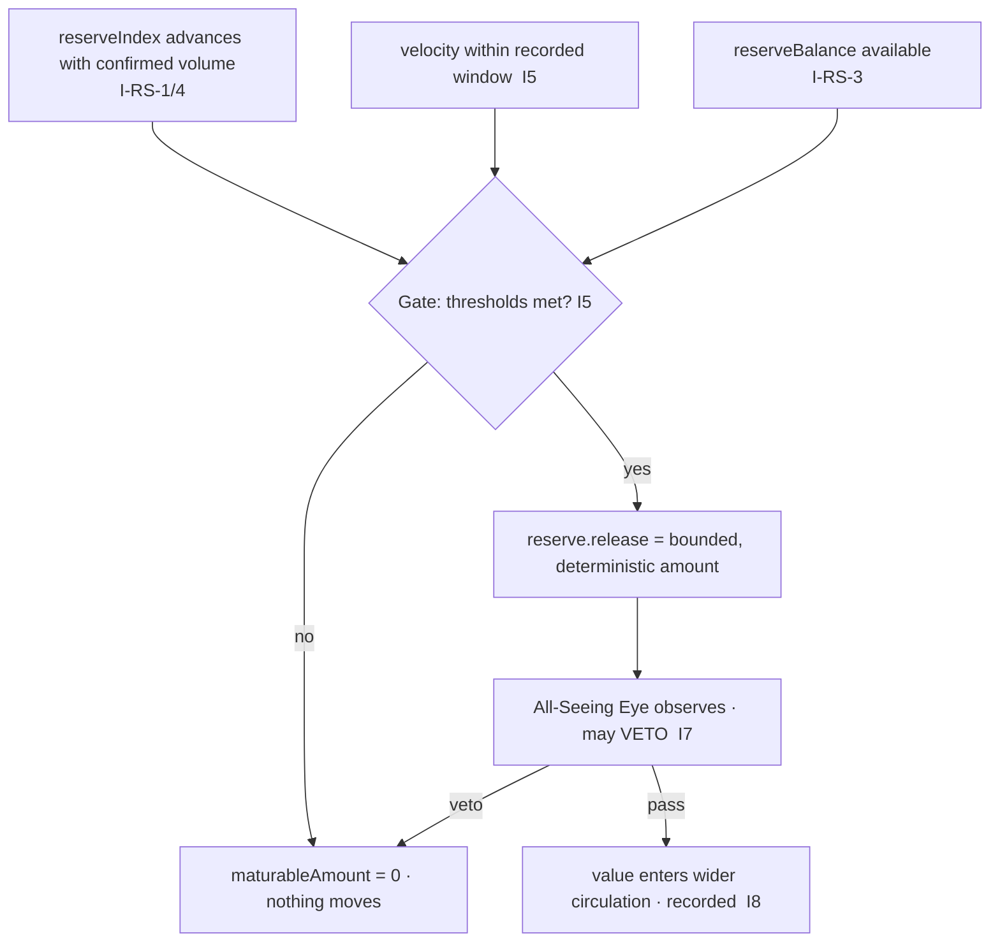

# AST Reserve — Maturity Gate (Release)

**Stands on:** I4 (reserve is AST's own), I5 (determinism), I6 (no speculative surface), I7 (Eye observes and vetoes), I8 (append-only causality); and I‑RS‑2 (never a free authority), I‑RS‑4 (monotone index). See `README.md` §§1–2, 6.

## Purpose

Define the *only* way value in AST's own reserve enters wider circulation: a **maturity gate** — a deterministic, threshold-keyed, Eye-vetoable, recorded process. Because the reserve is AST's own (I4) and all movement is deterministic (I5), maturation is not a payout someone authorizes; it is a computed consequence of recorded conditions. This document derives the gate and shows why each classic alternative (buyback, liquidity, price-floor, volatility control) has **no object** in this model.

---

## 1. Why a gate at all — and why not a payout

Value accrues to the reserve continuously (`reserve_accrual.md`). For any of it to circulate more widely, *something* must move it — and the only kind of move the model admits is a **deterministic, recorded** one (I5, I8). A discretionary payout — "a role decides to release X" — is exactly a free authority moving reserve value, which I‑RS‑2 forbids.

*Because* I5 requires every token movement to be reproducible from canonical inputs, and I‑RS‑2 forbids setting reserve value by decree, the release mechanism must be a **function of recorded state**, not a decision. That function is the maturity gate: value matures when recorded thresholds on `reserveIndex` and velocity are met, and not otherwise. The gate replaces discretion with computation.

---

## 2. The gate, causally

```
inputs (all recorded in NodeChain, I8):
  reserveIndex        = log10(1 + totalProcessVolume)     [I‑RS‑1/4]   — capitalization signal
  velocity            = circulation rate over a window     [I5]        — measured, recorded
  reserveBalance      = Σ accrual − Σ release              [I‑RS‑3]     — how much is available
  thresholds          = bounded, role-set gate parameters  [README §6] — recorded before effect (I8)

gate (a pure function of the inputs):
  IF reserveIndex has advanced by ≥ indexStep since last release   [I‑RS‑4]
  AND velocity is within its recorded window                       [I5]
  THEN maturableAmount = f(reserveBalance, thresholds)             (bounded, deterministic)
  ELSE maturableAmount = 0
```



Every branch is a function of recorded inputs. Given the same NodeChain state, the gate yields the same `maturableAmount` on every node (I5). No step reads a market price, and no step lets a role name an amount.

---

## 3. The thresholds are bounded parameters, never levers

The gate reads parameters — an `indexStep`, a velocity window — set by the role-based oversight committee (`README.md` §6). Their discipline:

- **Bounded (I5).** They move only within protocol bounds, so no setting can force an unconditional release (an `indexStep` of zero would make maturation fire on every state, defeating the gate's purpose and its determinism). Within bounds, every setting still yields a computed, reproducible outcome.
- **Recorded before effect (I8).** A threshold change is appended to NodeChain before any release uses it, so the parameters in force for any release are reproducible (I5).
- **Not a way to move value directly (I‑RS‑2).** A committee may only adjust bounded gate parameters. It may never set `reserveIndex`, name a release amount, or credit an account by decree. The only thing that moves value is the gate function evaluating recorded state.

Because the committee acts only on bounded parameters and never on the balance, the gate is steering-*resistant*: the most a change can do is shift *when* deterministic maturation occurs, never *whether* it is deterministic.

---

## 4. The Eye's role at the gate (I7)

Every `reserve.release` is observed by the All-Seeing Eye, which **can veto** (halt) any release that would violate I1–I6 or I‑RS‑1..4 — for example, a release computed from a stale or non-monotone index, an amount exceeding `reserveBalance`, or a destination inconsistent with wider circulation. The Eye never *initiates* a release; its power is strictly negative. A vetoed release moves nothing and is recorded as vetoed (I8), leaving the reserve unchanged.

---

## 5. The record a release leaves

A release is appended to NodeChain **before** it is acknowledged (I8):

```
reserve.release {
  releaseId,
  reserveIndexAt,        // the index value that satisfied the gate (I‑RS‑4)
  velocityAt,            // the measured velocity (I5)
  thresholds,            // the bounded parameters in force (I8)
  amount,                // = f(reserveBalance, thresholds), deterministic
  source: SYSTEM_RESERVE // AST's own reserve (I4)
}
```

The event names its own cause (`reserveIndexAt`, `velocityAt`, `thresholds`) and its own arithmetic (`amount`), so any auditor can recompute it and confirm the gate fired correctly (I5). The reserve balance after release is `Σ accrual − Σ release`, reproducible by replay.

---

## 6. What the gate is not — each has no object here

Maturation is deterministic capitalization entering circulation. It is emphatically none of the following, and each is excluded because its **input is absent** from the model, not by prohibition:

| Alternative | What it would need | Why it has no object here | Invariant |
|---|---|---|---|
| Buyback | a speculative float of ARO to purchase | process parts are born and burned; no float exists to buy back | I2, I6 |
| Liquidity provision | an external venue / trading pair to supply | AST names no external venue; there is no pair | I6 |
| Price-floor / price support | a market price to hold above a level | ARO has no market price to floor | I6 |
| Volatility control / velocity throttle *as a price defense* | a price whose swings are managed | no price exists; velocity is a *gate input*, never a price lever | I6 |
| Yield / staking distribution | a deposited balance earning a return | payment follows confirmed work only; no deposit earns | I3, I6 |
| Discretionary treasury payout | a role that names an amount to pay | value moves only by the deterministic gate function | I5, I‑RS‑2 |

Note the one subtlety: **velocity appears in the gate**, but not as a thing to throttle for price. It is a *measured, recorded input* the gate reads to decide whether maturation is well-conditioned (I5). There is no price it is defending, because there is no price (I6). Reintroducing any row above would first require inventing a market surface the model is defined to exclude, breaking I6 and, through it, the closure of the layer.

---

## 7. What actually guarantees soundness of maturation (structural)

- **Nothing matures without confirmed backing (I‑RS‑1/4).** The gate opens only as `reserveIndex` advances, and the index advances only with confirmed process volume. Maturation therefore tracks accumulated confirmed work, never sentiment.
- **Nothing matures beyond what accrued (I‑RS‑3).** `amount ≤ reserveBalance`, and the balance is only the retained 25% of commissions on confirmed work. The reserve cannot release value it never earned.
- **Nothing matures by decree (I‑RS‑2, I5).** The amount is a function of recorded state; no role names it.
- **Nothing matures unobserved (I7, I8).** Every release is Eye-observed and appended before effect; a violating release is vetoed and moves nothing.

Soundness is thus a property of the gate's state space, not a corrective intervention: the unsound releases a discretionary treasury could make are not reachable states.

---

## 8. Failure codes

| Code | Condition | Invariant defended |
|---|---|---|
| `E_RELEASE_NO_GATE` | a release with no recorded threshold-satisfaction cause | I5, I‑RS‑2 |
| `E_RELEASE_DISCRETIONARY` | an amount named by a role rather than computed by the gate | I‑RS‑2 |
| `E_RELEASE_STALE_INDEX` | `reserveIndexAt` not equal to the index recomputed from volume | I‑RS‑1, I‑RS‑4 |
| `E_RELEASE_OVER_BALANCE` | `amount > reserveBalance` | I‑RS‑3 |
| `E_RELEASE_EXTERNAL_VENUE` | a release framed as buyback / liquidity / price support | I6 |
| `E_RELEASE_UNVETOABLE` | a release acknowledged before the Eye could observe it | I7, I8 |
| `E_RELEASE_REPLAY` | a recorded `reserve.release` applied a second time | I5, I8 |

---

## 9. Reference

- Index the gate reads: `reserve_index.md`.
- Balance the gate draws on: `reserve_accrual.md` §4.
- Eye veto discipline: `01_coin_engine/README.md` §6, I7.
- Gate implementation: `src/reserve/reserve.service.ts` — `ReserveService.maturityGate()`, `release()`.
