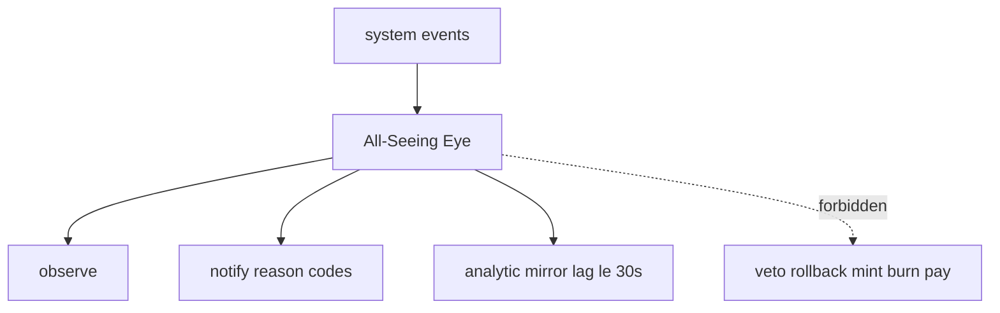
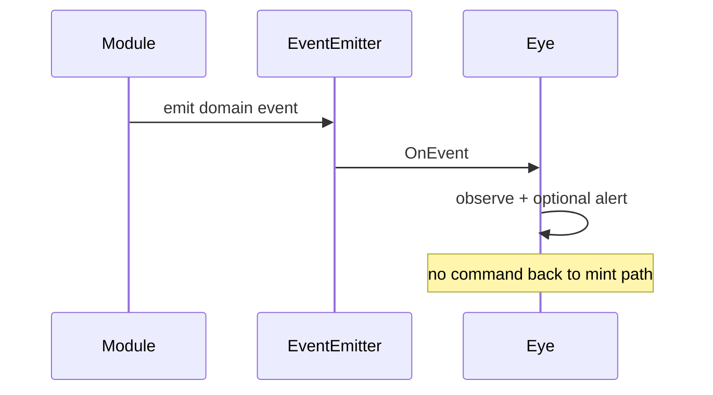

# DIAGRAM — `all-seeing-eye`

## Observe only plane

```mermaid
flowchart TB
  Events[system events] --> Eye[All-Seeing Eye]
  Eye --> Observe[observe]
  Eye --> Notify[notify reason codes]
  Eye --> Mirror[analytic mirror lag le 30s]
  Eye -.->|forbidden| Veto[veto rollback mint burn pay]
```

## Event intake

```mermaid
sequenceDiagram
  participant M as Module
  participant Bus as EventEmitter
  participant Eye
  M->>Bus: emit domain event
  Bus->>Eye: OnEvent
  Eye->>Eye: observe + optional alert
  Note over Eye: no command back to mint path
```
