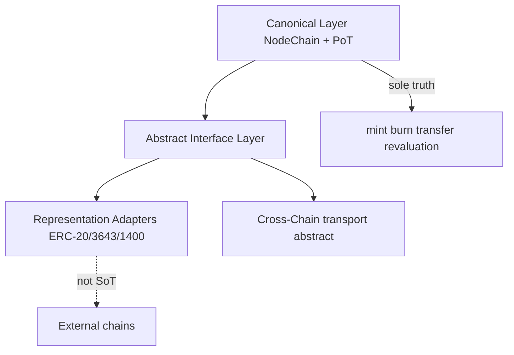
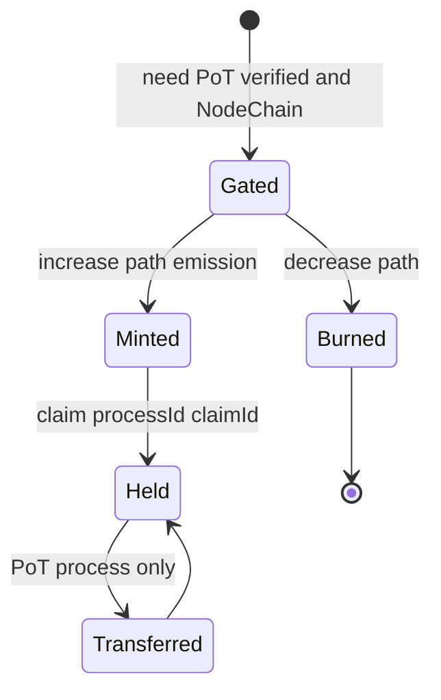
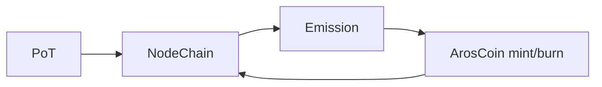

# DIAGRAM — `aroscoin`

## AST Token Protocol layers

```mermaid
flowchart TB
  CL[Canonical Layer NodeChain + PoT] --> AIL[Abstract Interface Layer]
  AIL --> RA[Representation Adapters ERC-20/3643/1400]
  AIL --> XL[Cross-Chain transport abstract]
  RA -.->|not SoT| External[External chains]
  CL -->|sole truth| Supply[mint burn transfer revaluation]
```

## Mint burn lifecycle

```mermaid
stateDiagram-v2
  [*] --> Gated: need PoT verified and NodeChain
  Gated --> Minted: increase path emission
  Gated --> Burned: decrease path
  Minted --> Held: claim processId claimId
  Burned --> [*]
  Held --> Transferred: PoT process only
  Transferred --> Held
```

## Emission binding

```mermaid
flowchart LR
  PoT --> NC[NodeChain]
  NC --> Em[Emission]
  Em --> AC[ArosCoin mint/burn]
  AC --> NC
```
