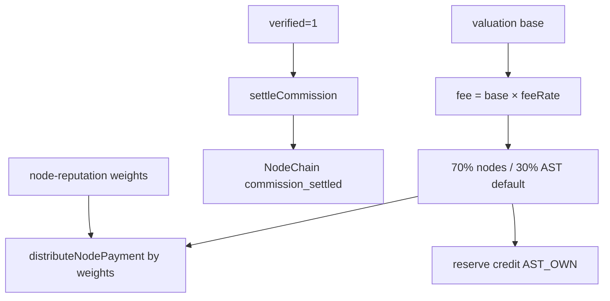
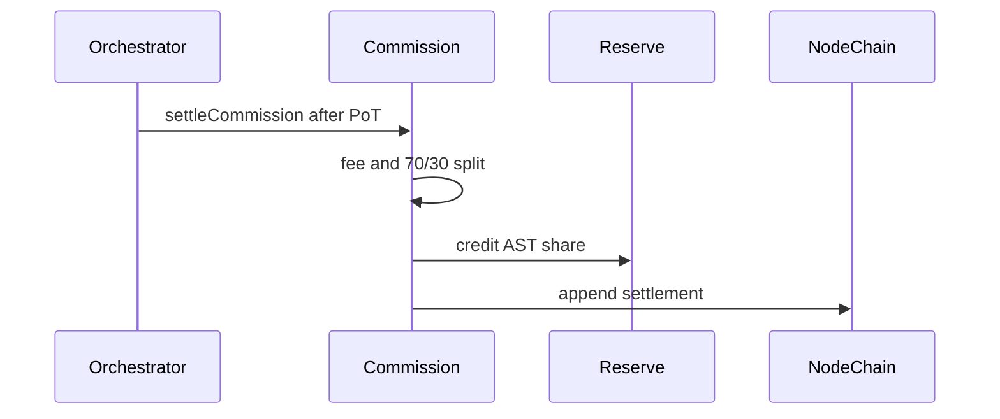

# DIAGRAM — `commission`

## Post-factum settlement

```mermaid
flowchart TB
  PoT[verified=1] --> Settle[settleCommission]
  Val[valuation base] --> Fee[fee = base × feeRate]
  Fee --> Split[70% nodes / 30% AST default]
  Split --> Nodes[distributeNodePayment by weights]
  Split --> AST[reserve credit AST_OWN]
  Settle --> NC[NodeChain commission_settled]
  Weights[node-reputation weights] --> Nodes
```

## Sequence

```mermaid
sequenceDiagram
  participant O as Orchestrator
  participant C as Commission
  participant R as Reserve
  participant N as NodeChain
  O->>C: settleCommission after PoT
  C->>C: fee and 70/30 split
  C->>R: credit AST share
  C->>N: append settlement
```
