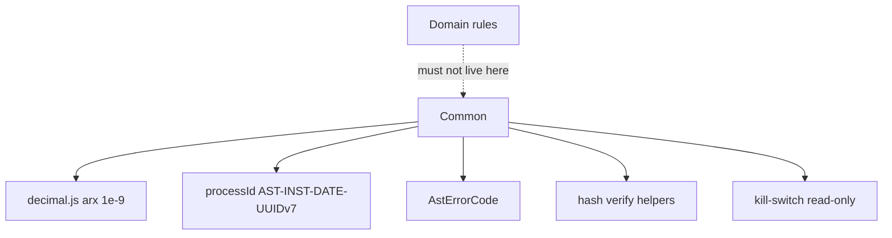

# DIAGRAM — `common`

## Utility surface

```mermaid
flowchart TB
  Common --> Money[decimal.js arx 1e-9]
  Common --> Ids[processId AST-INST-DATE-UUIDv7]
  Common --> Errors[AstErrorCode]
  Common --> Crypto[hash verify helpers]
  Common --> Kill[kill-switch read-only]
  Domain[Domain rules] -.->|must not live here| Common
```
