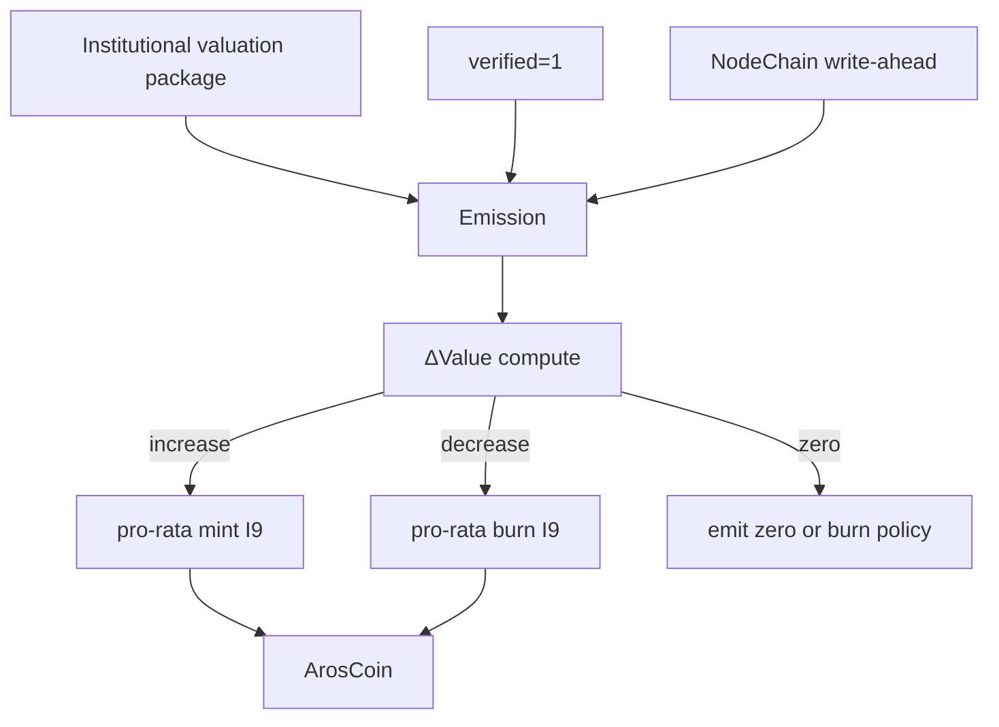
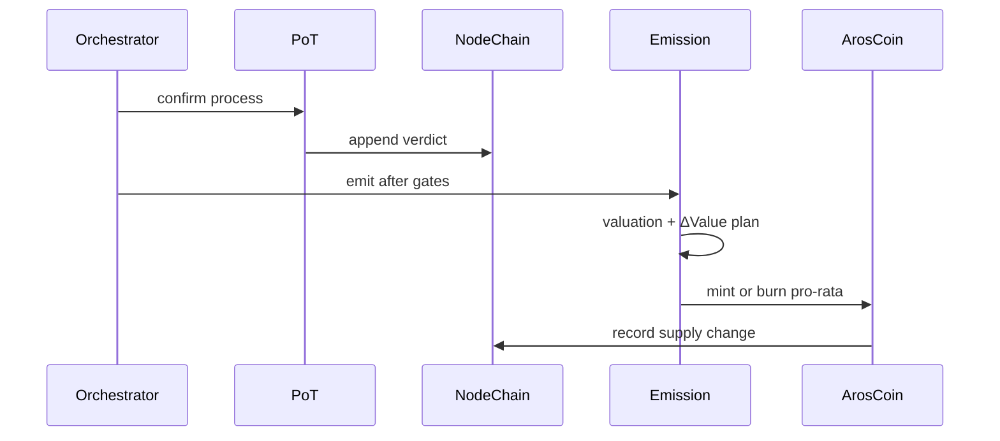

# DIAGRAM — `emission`

## Valuation to supply

```mermaid
flowchart TB
  Inst[Institutional valuation package] --> Em[Emission]
  PoT[verified=1] --> Em
  NC[NodeChain write-ahead] --> Em
  Em --> Delta[ΔValue compute]
  Delta -->|increase| Mint[pro-rata mint I9]
  Delta -->|decrease| Burn[pro-rata burn I9]
  Delta -->|zero| Policy[emit zero or burn policy]
  Mint --> AC[ArosCoin]
  Burn --> AC
```

## Sequence

```mermaid
sequenceDiagram
  participant O as Orchestrator
  participant P as PoT
  participant N as NodeChain
  participant E as Emission
  participant A as ArosCoin
  O->>P: confirm process
  P->>N: append verdict
  O->>E: emit after gates
  E->>E: valuation + ΔValue plan
  E->>A: mint or burn pro-rata
  A->>N: record supply change
```
