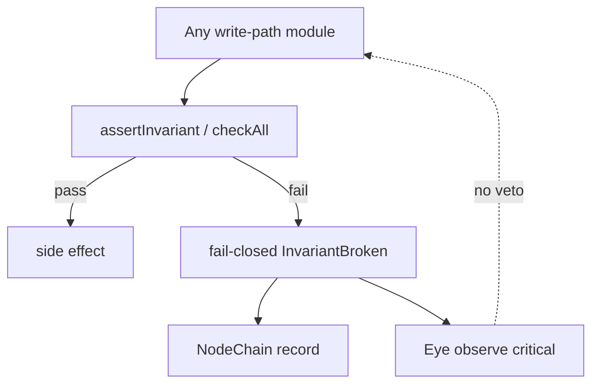
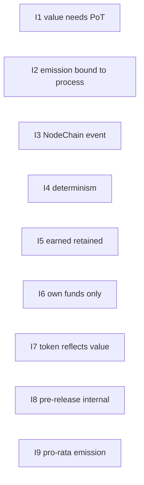

# DIAGRAM — `invariants`

## I1–I9 guard plane

```mermaid
flowchart TB
  Callers[Any write-path module] --> Assert[assertInvariant / checkAll]
  Assert -->|pass| Proceed[side effect]
  Assert -->|fail| FC[fail-closed InvariantBroken]
  FC --> NC[NodeChain record]
  FC --> Eye[Eye observe critical]
  Eye -.->|no veto| Callers
```

## Invariant map

```mermaid
flowchart LR
  I1[I1 value needs PoT]
  I2[I2 emission bound to process]
  I3[I3 NodeChain event]
  I4[I4 determinism]
  I5[I5 earned retained]
  I6[I6 own funds only]
  I7[I7 token reflects value]
  I8[I8 pre-release internal]
  I9[I9 pro-rata emission]
```
