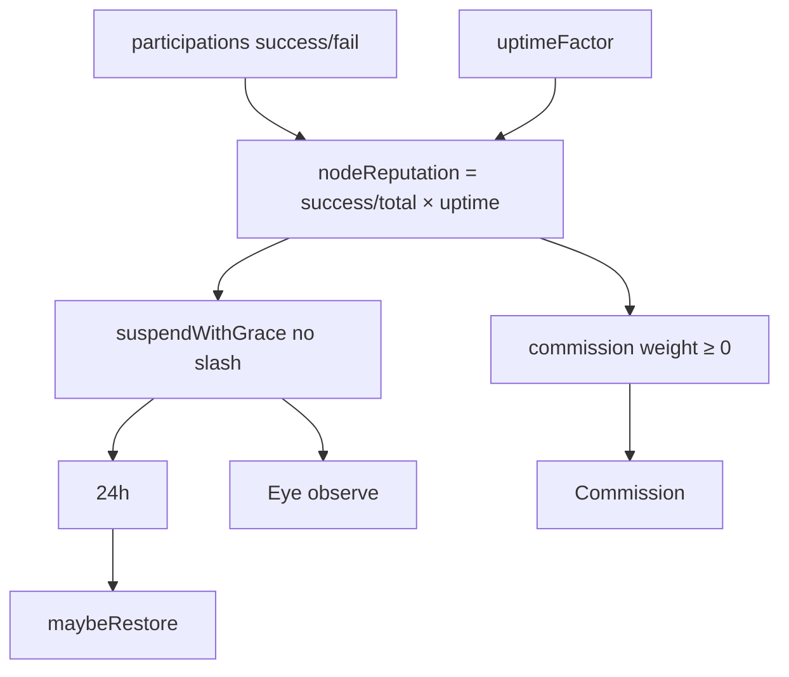

# DIAGRAM — `node-reputation`

## Reputation formula flow

```mermaid
flowchart TB
  Part[participations success/fail] --> Score
  Up[uptimeFactor] --> Score
  Score[nodeReputation = success/total × uptime] --> Weight[commission weight ≥ 0]
  Score --> Suspend[suspendWithGrace no slash]
  Suspend --> Grace[24h]
  Grace --> Restore[maybeRestore]
  Suspend --> Eye[Eye observe]
  Weight --> Commission
```
