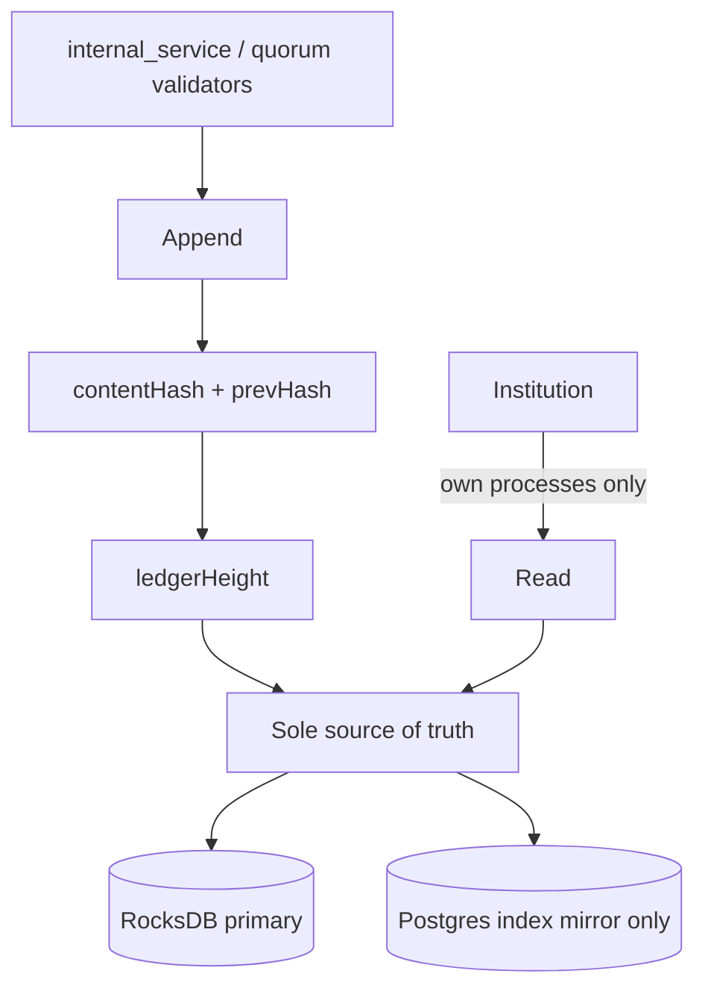
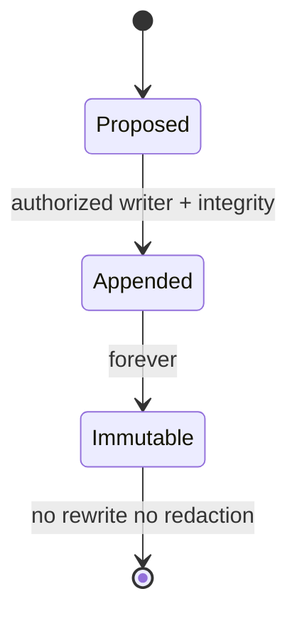
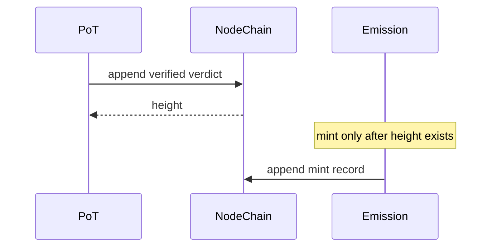

# DIAGRAM — `nodechain`

## Append-only ledger

```mermaid
flowchart TB
  Writers[internal_service / quorum validators] --> Append
  Append --> HashChain[contentHash + prevHash]
  HashChain --> Height[ledgerHeight]
  Height --> SoT[Sole source of truth]
  SoT --> RocksDB[(RocksDB primary)]
  SoT --> PG[(Postgres index mirror only)]
  Inst[Institution] -->|own processes only| Read
  Read --> SoT
```

## Record lifecycle

```mermaid
stateDiagram-v2
  [*] --> Proposed
  Proposed --> Appended: authorized writer + integrity
  Appended --> Immutable: forever
  Immutable --> [*]: no rewrite no redaction
```

## Write-ahead economic path

```mermaid
sequenceDiagram
  participant PoT
  participant NC as NodeChain
  participant Em as Emission
  PoT->>NC: append verified verdict
  NC-->>PoT: height
  Note over Em: mint only after height exists
  Em->>NC: append mint record
```
