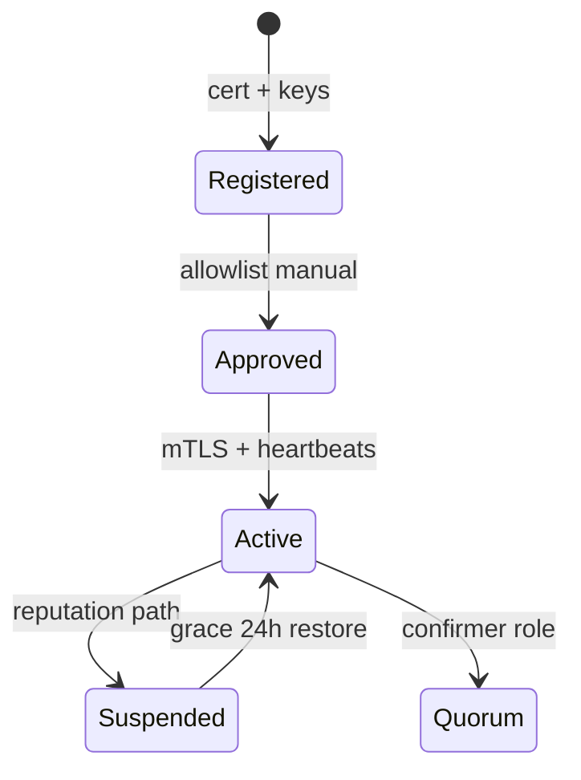
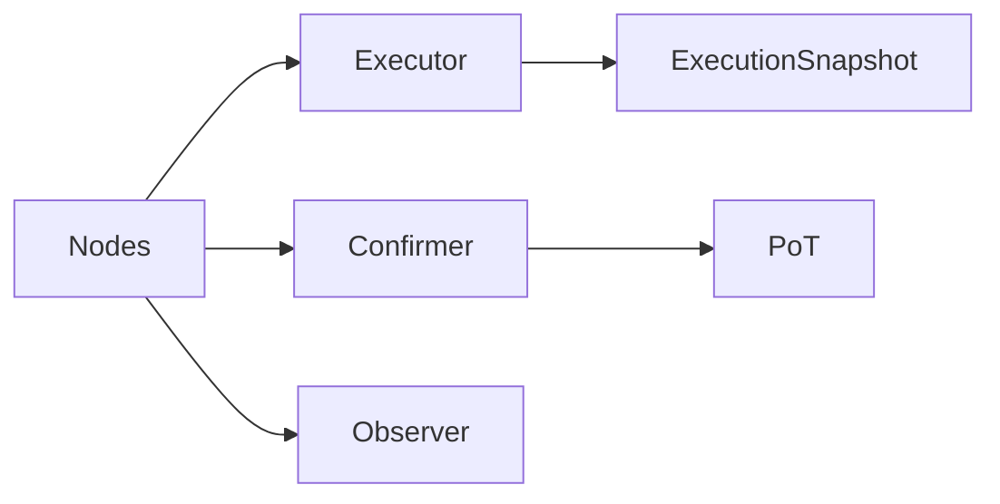

# DIAGRAM — `nodes`

## Node identity lifecycle

```mermaid
stateDiagram-v2
  [*] --> Registered: cert + keys
  Registered --> Approved: allowlist manual
  Approved --> Active: mTLS + heartbeats
  Active --> Suspended: reputation path
  Suspended --> Active: grace 24h restore
  Active --> Quorum: confirmer role
```

## Roles

```mermaid
flowchart LR
  Nodes --> Executor
  Nodes --> Confirmer
  Nodes --> Observer
  Confirmer --> PoT
  Executor --> Snapshot[ExecutionSnapshot]
```
