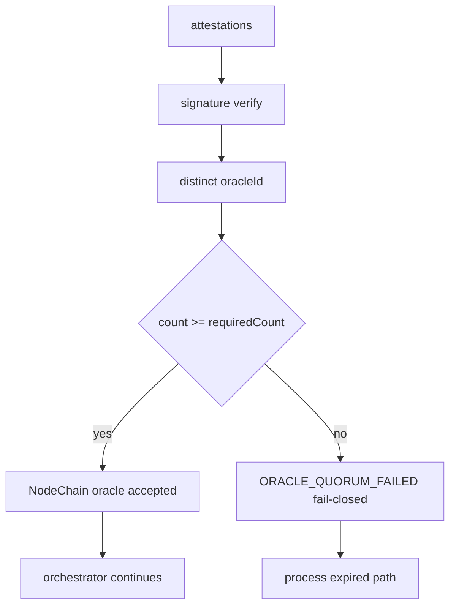

# DIAGRAM — `oracle-gateway`

## Multi-oracle accept

```mermaid
flowchart TB
  Att[attestations] --> Verify[signature verify]
  Verify --> Dedupe[distinct oracleId]
  Dedupe --> Q{count >= requiredCount}
  Q -->|yes| NC[NodeChain oracle accepted]
  Q -->|no| Fail[ORACLE_QUORUM_FAILED fail-closed]
  NC --> Orch[orchestrator continues]
  Fail --> Exp[process expired path]
```
