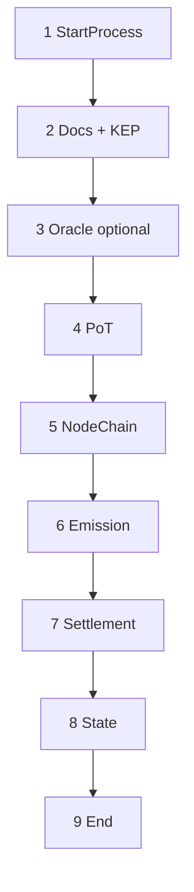
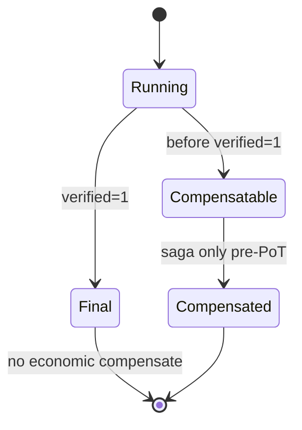
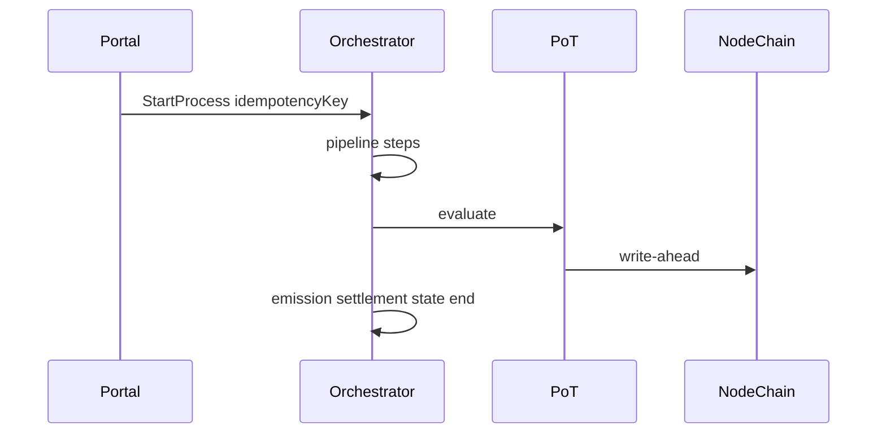

# DIAGRAM — `orchestrator`

## Fixed 9-step pipeline

```mermaid
flowchart TB
  S1[1 StartProcess] --> S2[2 Docs + KEP]
  S2 --> S3[3 Oracle optional]
  S3 --> S4[4 PoT]
  S4 --> S5[5 NodeChain]
  S5 --> S6[6 Emission]
  S6 --> S7[7 Settlement]
  S7 --> S8[8 State]
  S8 --> S9[9 End]
```

## Compensation boundary

```mermaid
stateDiagram-v2
  [*] --> Running
  Running --> Compensatable: before verified=1
  Running --> Final: verified=1
  Compensatable --> Compensated: saga only pre-PoT
  Final --> [*]: no economic compensate
  Compensated --> [*]
```

## Entry sequence

```mermaid
sequenceDiagram
  participant Portal
  participant Orch as Orchestrator
  participant PoT
  participant NC as NodeChain
  Portal->>Orch: StartProcess idempotencyKey
  Orch->>Orch: pipeline steps
  Orch->>PoT: evaluate
  PoT->>NC: write-ahead
  Orch->>Orch: emission settlement state end
```
