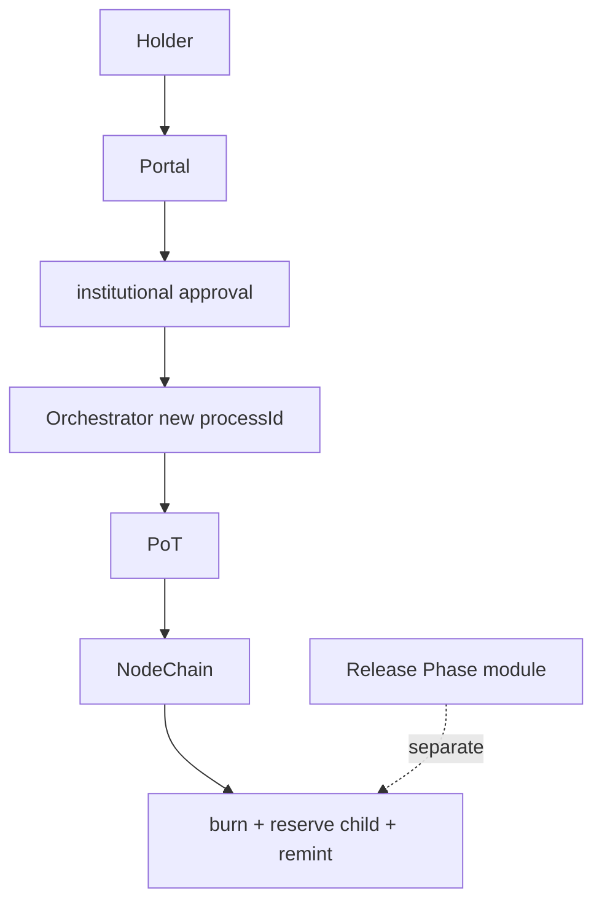
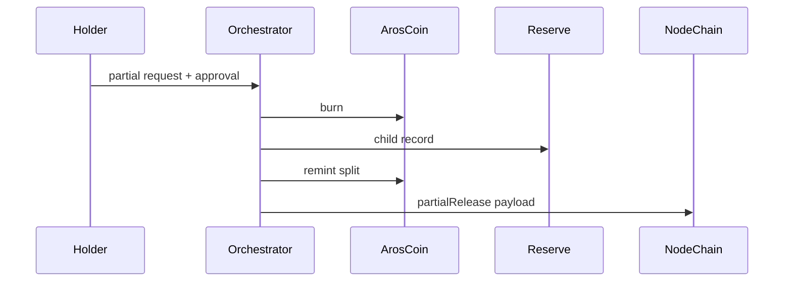

# DIAGRAM — `partial-release`

## Partial vs phase

```mermaid
flowchart TB
  Holder --> Portal
  Portal --> Inst[institutional approval]
  Inst --> Orch[Orchestrator new processId]
  Orch --> PoT --> NC[NodeChain]
  NC --> Atomic[burn + reserve child + remint]
  Phase[Release Phase module] -.->|separate| Atomic
```

## Atomic saga

```mermaid
sequenceDiagram
  participant H as Holder
  participant O as Orchestrator
  participant A as ArosCoin
  participant R as Reserve
  participant N as NodeChain
  H->>O: partial request + approval
  O->>A: burn
  O->>R: child record
  O->>A: remint split
  O->>N: partialRelease payload
```
