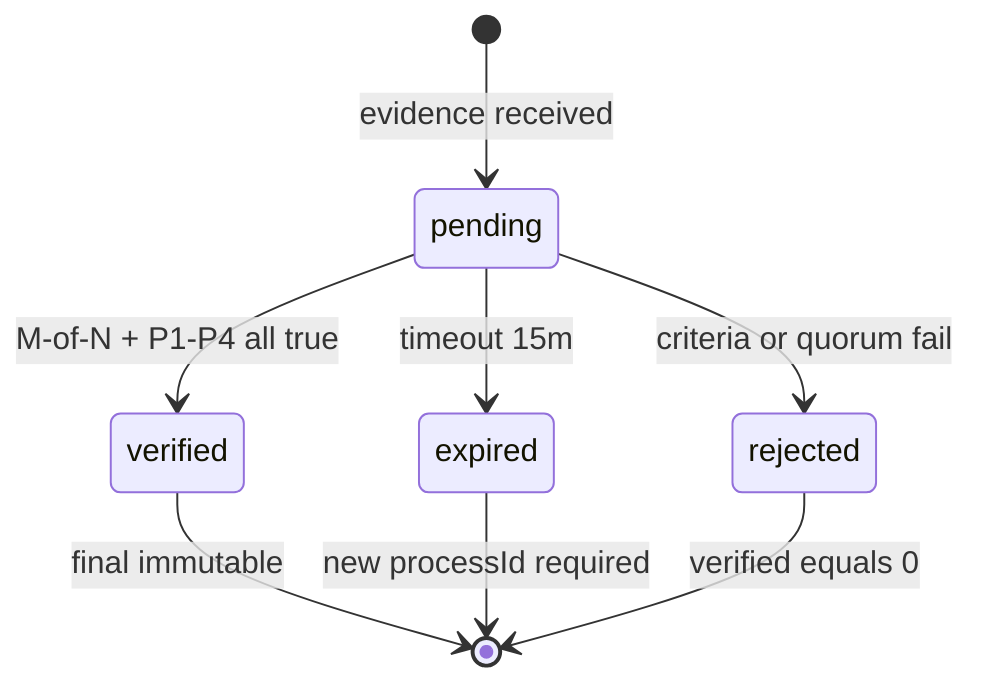
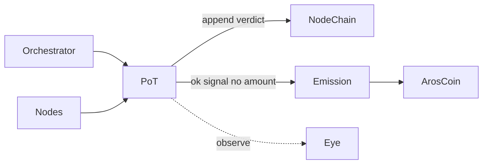
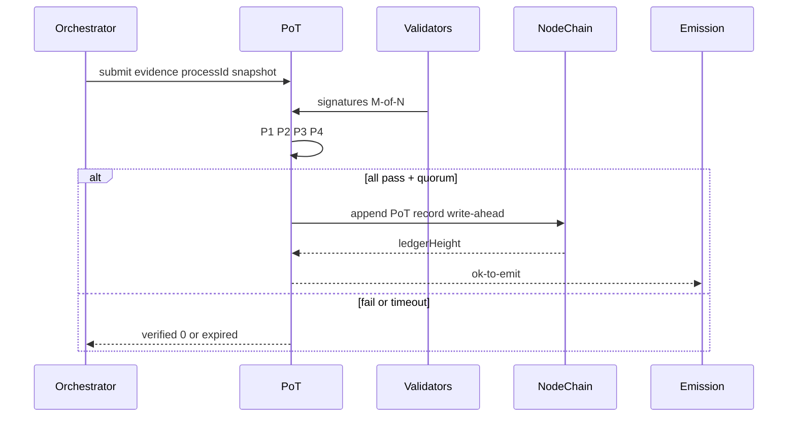

# DIAGRAM — `pot`

## Value gate lifecycle

```mermaid
stateDiagram-v2
  [*] --> pending: evidence received
  pending --> verified: M-of-N + P1-P4 all true
  pending --> expired: timeout 15m
  pending --> rejected: criteria or quorum fail
  verified --> [*]: final immutable
  expired --> [*]: new processId required
  rejected --> [*]: verified equals 0
```

## Context map

```mermaid
flowchart LR
  Orchestrator --> PoT
  Nodes --> PoT
  PoT -->|append verdict| NodeChain
  PoT -->|ok signal no amount| Emission
  PoT -.->|observe| Eye
  Emission --> ArosCoin
```

## Evaluation sequence

```mermaid
sequenceDiagram
  participant O as Orchestrator
  participant P as PoT
  participant V as Validators
  participant N as NodeChain
  participant E as Emission
  O->>P: submit evidence processId snapshot
  V->>P: signatures M-of-N
  P->>P: P1 P2 P3 P4
  alt all pass + quorum
    P->>N: append PoT record write-ahead
    N-->>P: ledgerHeight
    P-->>E: ok-to-emit
  else fail or timeout
    P-->>O: verified 0 or expired
  end
```
