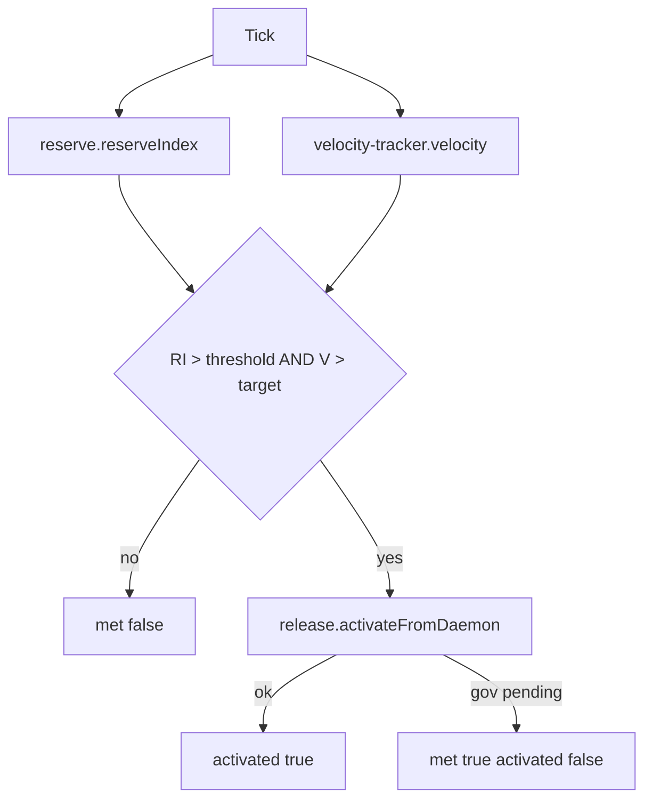

# DIAGRAM — `release-daemon`

## Tick loop

```mermaid
flowchart TB
  Tick --> RI[reserve.reserveIndex]
  Tick --> V[velocity-tracker.velocity]
  RI --> Eval{RI > threshold AND V > target}
  V --> Eval
  Eval -->|no| Wait[met false]
  Eval -->|yes| Act[release.activateFromDaemon]
  Act -->|ok| On[activated true]
  Act -->|gov pending| Def[met true activated false]
```
