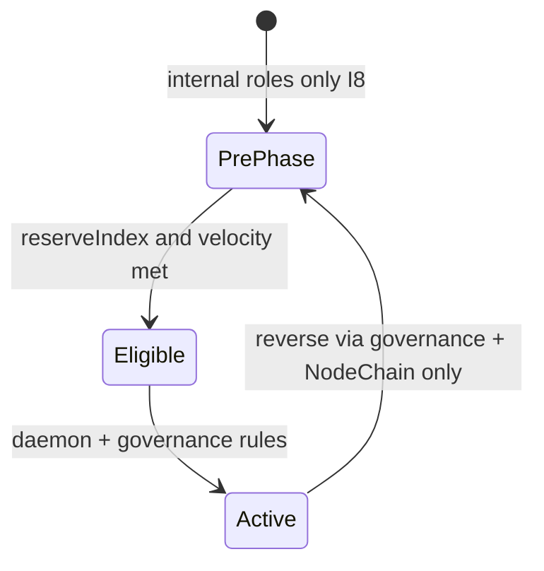
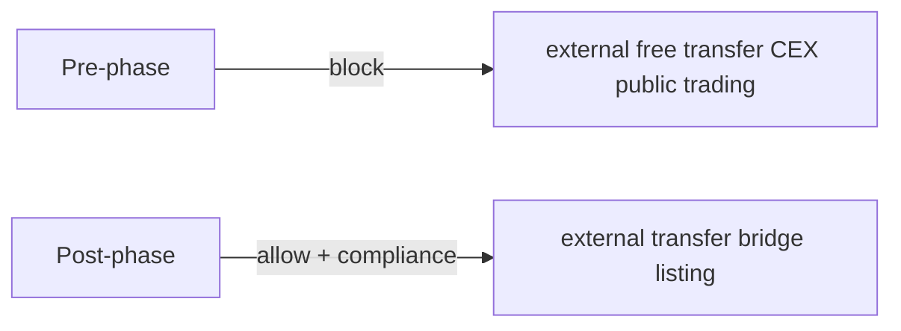

# DIAGRAM — `release`

## Release Phase state

```mermaid
stateDiagram-v2
  [*] --> PrePhase: internal roles only I8
  PrePhase --> Eligible: reserveIndex and velocity met
  Eligible --> Active: daemon + governance rules
  Active --> PrePhase: reverse via governance + NodeChain only
```

## Gates

```mermaid
flowchart LR
  Pre[Pre-phase] -->|block| Ext[external free transfer CEX public trading]
  Active[Post-phase] -->|allow + compliance| Ext2[external transfer bridge listing]
```
