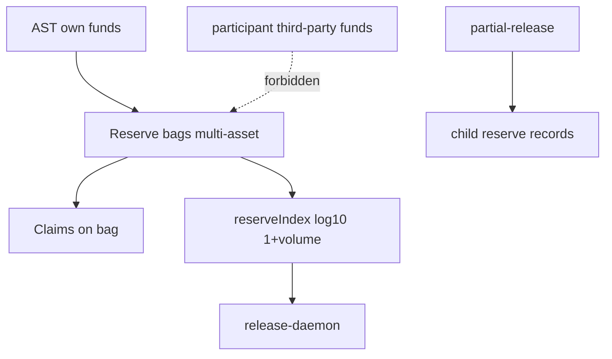
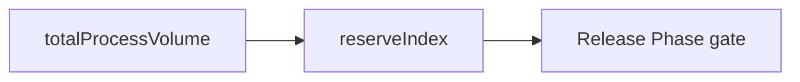

# DIAGRAM — `reserve`

## Own funds only

```mermaid
flowchart TB
  Own[AST own funds] --> Bags[Reserve bags multi-asset]
  Bags --> Claims[Claims on bag]
  Bags --> Index[reserveIndex log10 1+volume]
  Index --> Daemon[release-daemon]
  Partial[partial-release] --> Child[child reserve records]
  Forbidden[participant third-party funds] -.->|forbidden| Bags
```

## reserveIndex

```mermaid
flowchart LR
  Vol[totalProcessVolume] --> RI[reserveIndex]
  RI --> Release[Release Phase gate]
```
