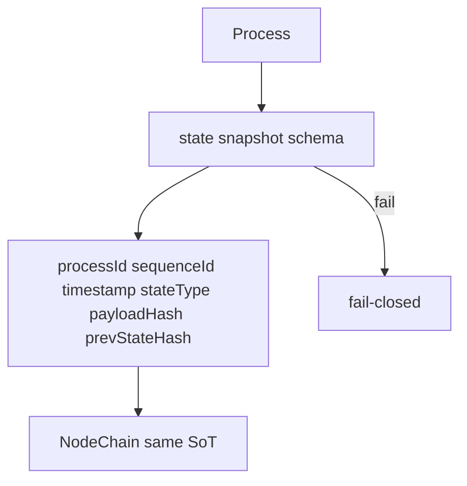
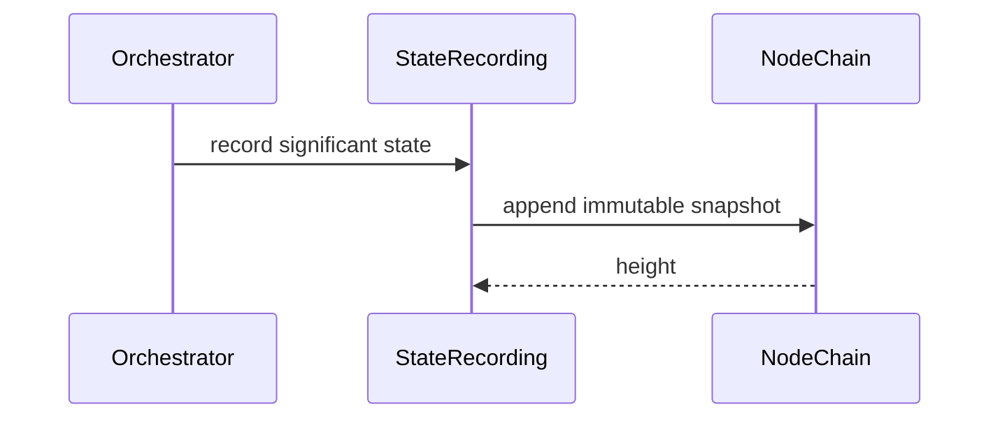

# DIAGRAM — `state-recording`

## Snapshots inside NodeChain

```mermaid
flowchart TB
  Process --> Snap[state snapshot schema]
  Snap --> Fields[processId sequenceId timestamp stateType payloadHash prevStateHash]
  Fields --> NC[NodeChain same SoT]
  Snap -->|fail| FC[fail-closed]
```

## Write-ahead

```mermaid
sequenceDiagram
  participant Orch as Orchestrator
  participant SR as StateRecording
  participant NC as NodeChain
  Orch->>SR: record significant state
  SR->>NC: append immutable snapshot
  NC-->>SR: height
```
