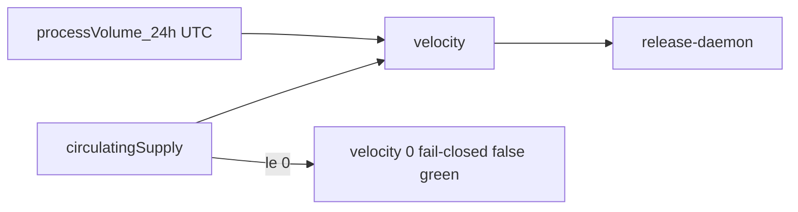

# DIAGRAM — `velocity-tracker`

## Velocity formula

```mermaid
flowchart LR
  Vol[processVolume_24h UTC] --> Vel[velocity]
  Sup[circulatingSupply] --> Vel
  Vel --> Daemon[release-daemon]
  Sup -->|le 0| Zero[velocity 0 fail-closed false green]
```
