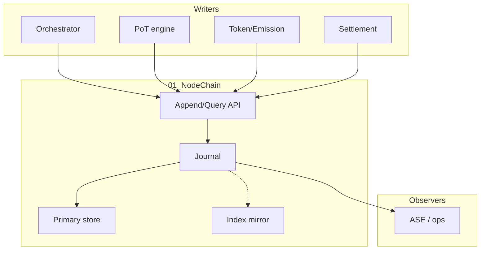

# Diagram — component map

```mermaid
flowchart TB
  subgraph writers [Writers]
    ORCH[Orchestrator]
    POT[PoT engine]
    TOK[Token/Emission]
    SET[Settlement]
  end
  subgraph nc [01_NodeChain]
    API[Append/Query API]
    J[Journal]
    ST[Primary store]
    IDX[Index mirror]
  end
  subgraph observers [Observers]
    ASE[ASE / ops]
  end
  ORCH --> API
  POT --> API
  TOK --> API
  SET --> API
  API --> J --> ST
  J -.-> IDX
  J --> ASE
```
