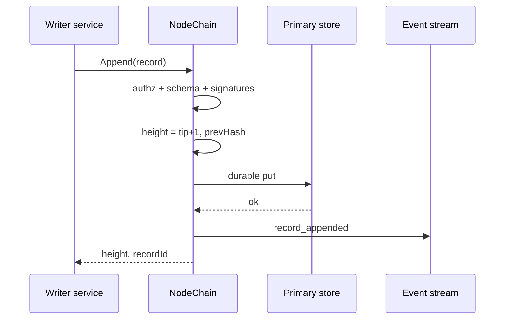

# Diagram — write path

```mermaid
sequenceDiagram
  participant W as Writer service
  participant NC as NodeChain
  participant S as Primary store
  participant E as Event stream

  W->>NC: Append(record)
  NC->>NC: authz + schema + signatures
  NC->>NC: height = tip+1, prevHash
  NC->>S: durable put
  S-->>NC: ok
  NC->>E: record_appended
  NC-->>W: height, recordId
```
