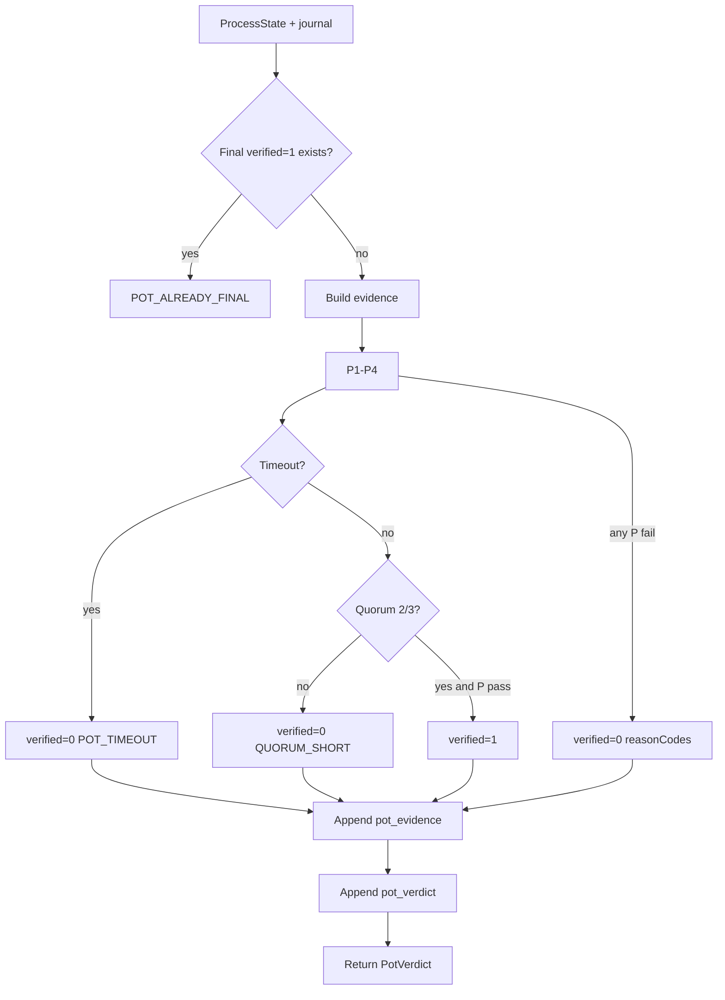

# Diagram — PoT verify

```mermaid
flowchart TD
  A[ProcessState + journal] --> B{Final verified=1 exists?}
  B -->|yes| Z[POT_ALREADY_FINAL]
  B -->|no| C[Build evidence]
  C --> D[P1-P4]
  D --> E{Timeout?}
  E -->|yes| F[verified=0 POT_TIMEOUT]
  E -->|no| G{Quorum 2/3?}
  G -->|no| H[verified=0 QUORUM_SHORT]
  D -->|any P fail| I[verified=0 reasonCodes]
  G -->|yes and P pass| J[verified=1]
  F --> K[Append pot_evidence]
  H --> K
  I --> K
  J --> K
  K --> L[Append pot_verdict]
  L --> M[Return PotVerdict]
```
