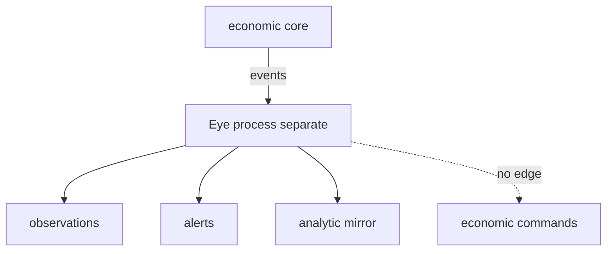
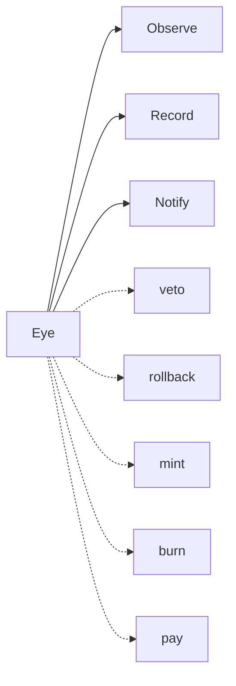

# DIAGRAM — `all-seeing-eye`

## Deployment intent

```mermaid
flowchart TB
  Core[economic core] -->|events| Eye[Eye process separate]
  Eye --> Obs[observations]
  Eye --> Alerts[alerts]
  Eye --> Mirror[analytic mirror]
  Eye -.->|no edge| CoreCmd[economic commands]
```

## Allowed actions

```mermaid
flowchart LR
  Eye --> Observe
  Eye --> Record
  Eye --> Notify
  Eye -.-> X1[veto]
  Eye -.-> X2[rollback]
  Eye -.-> X3[mint]
  Eye -.-> X4[burn]
  Eye -.-> X5[pay]
```
