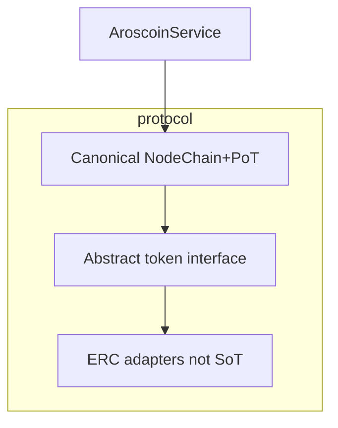
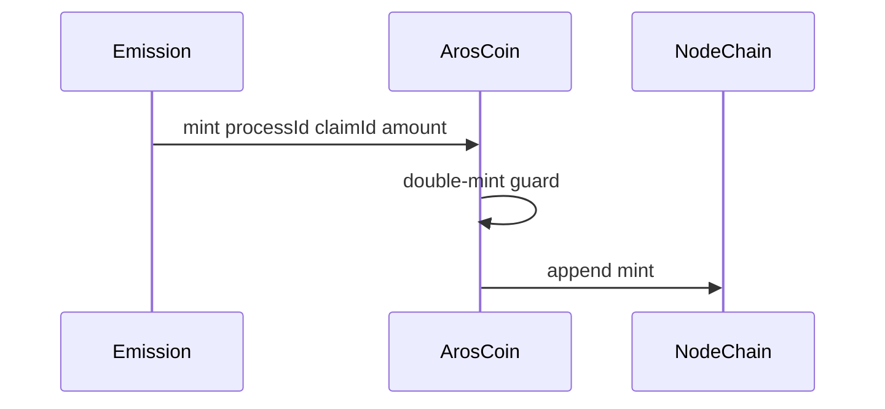
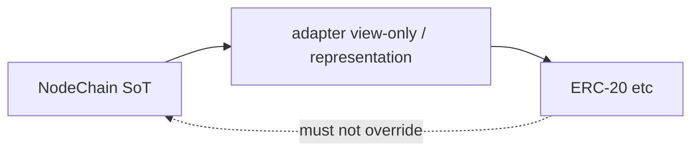

# DIAGRAM — `aroscoin`

## Protocol stack

```mermaid
flowchart TB
  subgraph protocol
    Canon[Canonical NodeChain+PoT]
    Abstract[Abstract token interface]
    Adapter[ERC adapters not SoT]
  end
  Canon --> Abstract --> Adapter
  Service[AroscoinService] --> Canon
```

## Mint path

```mermaid
sequenceDiagram
  participant Em as Emission
  participant A as ArosCoin
  participant N as NodeChain
  Em->>A: mint processId claimId amount
  A->>A: double-mint guard
  A->>N: append mint
```

## Adapter boundary

```mermaid
flowchart LR
  SoT[NodeChain SoT] --> View[adapter view-only / representation]
  View --> ERC[ERC-20 etc]
  ERC -.->|must not override| SoT
```
