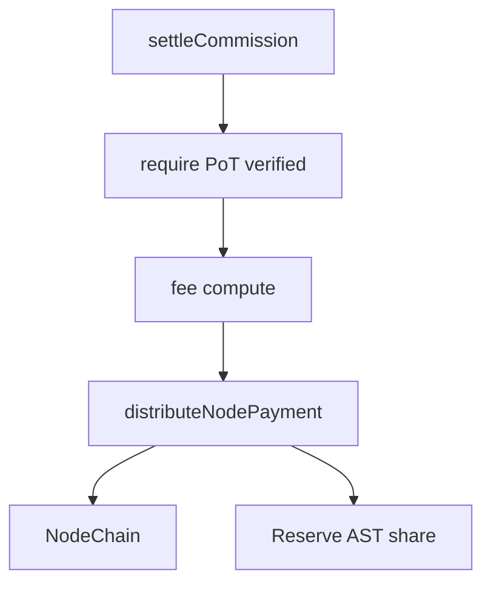
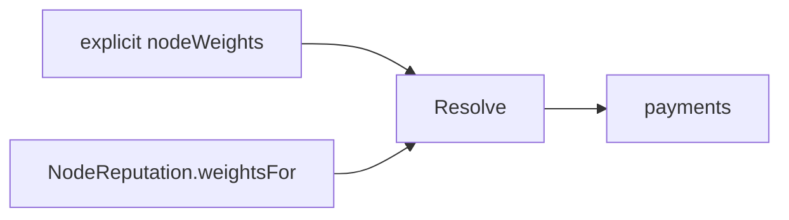

# DIAGRAM — `commission`

## Settlement module

```mermaid
flowchart TB
  API[settleCommission] --> Gate[require PoT verified]
  Gate --> Fee[fee compute]
  Fee --> Dist[distributeNodePayment]
  Dist --> NC[NodeChain]
  Dist --> Res[Reserve AST share]
```

## Weight source

```mermaid
flowchart LR
  Explicit[explicit nodeWeights] --> Resolve
  Rep[NodeReputation.weightsFor] --> Resolve
  Resolve --> Dist[payments]
```
