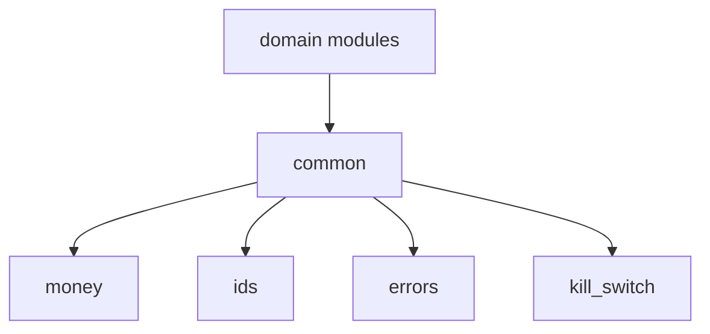
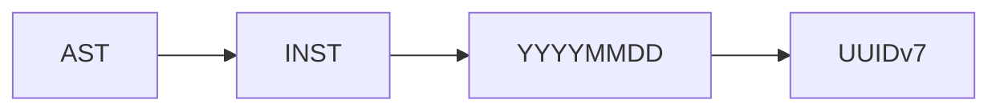

# DIAGRAM — `common`

## Barrel exports

```mermaid
flowchart TB
  common --> money
  common --> ids
  common --> errors
  common --> kill_switch
  App[domain modules] --> common
```

## processId shape

```mermaid
flowchart LR
  AST --> INST --> DATE[YYYYMMDD] --> UUID[UUIDv7]
```
