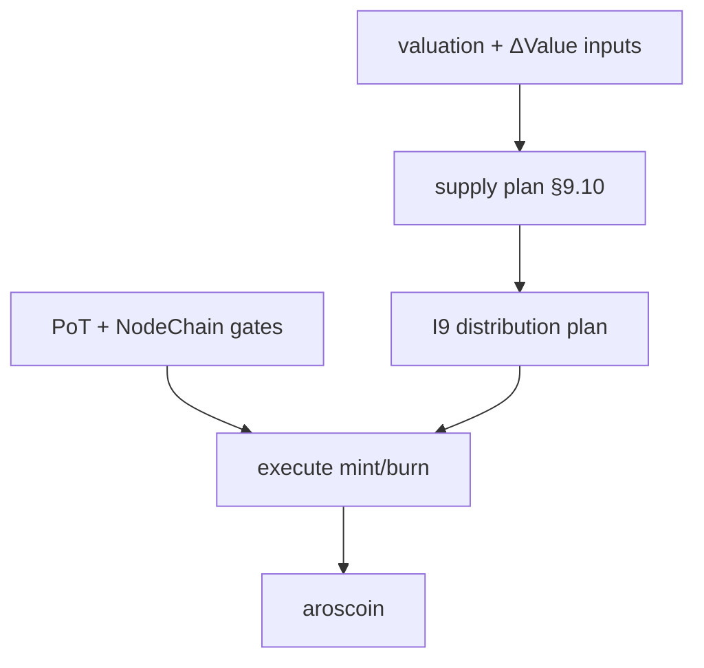
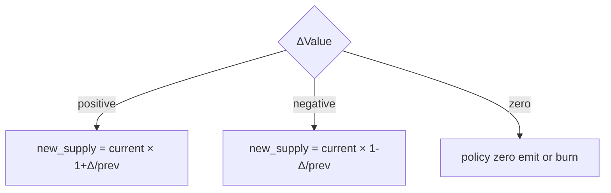

# DIAGRAM — `emission`

## Planning engine

```mermaid
flowchart TB
  In[valuation + ΔValue inputs] --> Plan[supply plan §9.10]
  Plan --> Prorata[I9 distribution plan]
  Gate[PoT + NodeChain gates] --> Exec[execute mint/burn]
  Prorata --> Exec
  Exec --> AC[aroscoin]
```

## ΔValue branches

```mermaid
flowchart TD
  D{ΔValue} -->|positive| Inc[new_supply = current × 1+Δ/prev]
  D -->|negative| Dec[new_supply = current × 1-Δ/prev]
  D -->|zero| Z[policy zero emit or burn]
```
