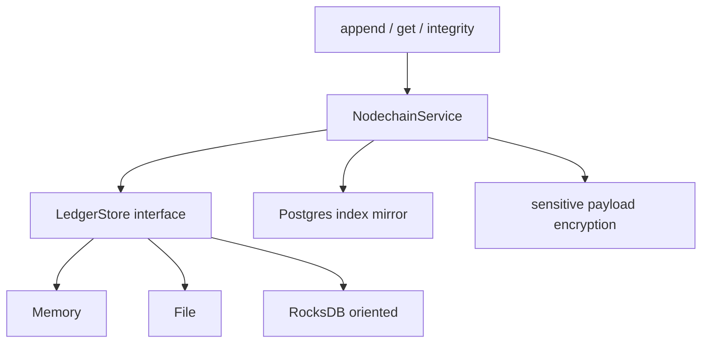
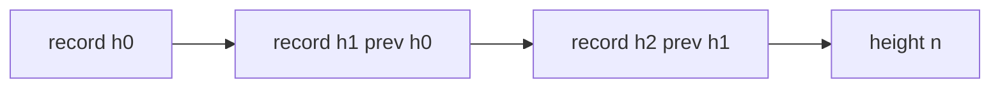
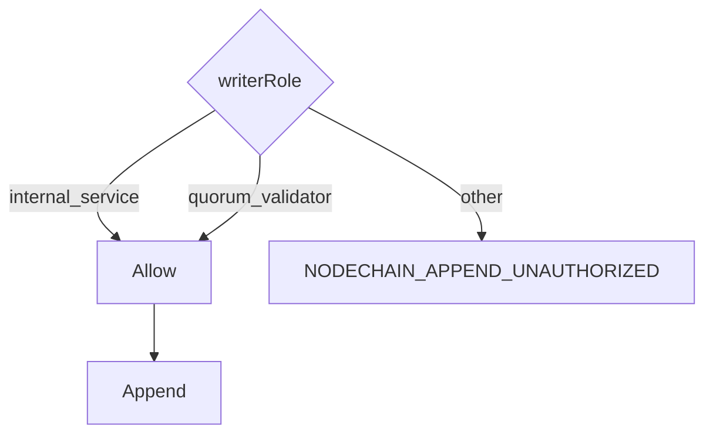

# DIAGRAM — `nodechain`

## Storage topology

```mermaid
flowchart TB
  API[append / get / integrity] --> Core[NodechainService]
  Core --> Store[LedgerStore interface]
  Store --> Mem[Memory]
  Store --> File[File]
  Store --> Rocks[RocksDB oriented]
  Core --> Mirror[Postgres index mirror]
  Core --> Enc[sensitive payload encryption]
```

## Hash chain

```mermaid
flowchart LR
  R0[record h0] --> R1[record h1 prev h0]
  R1 --> R2[record h2 prev h1]
  R2 --> Rn[height n]
```

## Authority

```mermaid
flowchart TB
  Role{writerRole} -->|internal_service| Allow
  Role -->|quorum_validator| Allow
  Role -->|other| Deny[NODECHAIN_APPEND_UNAUTHORIZED]
  Allow --> Append
```
