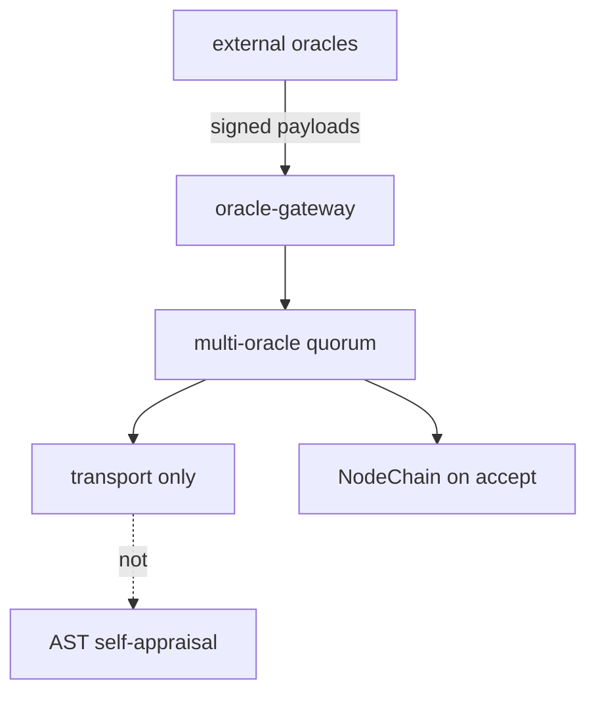
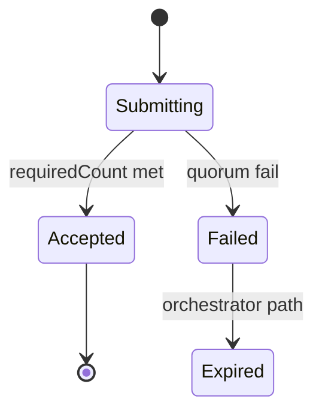

# DIAGRAM — `oracle-gateway`

## Trust model

```mermaid
flowchart TB
  Oracles[external oracles] -->|signed payloads| GW[oracle-gateway]
  GW --> Multi[multi-oracle quorum]
  Multi --> Transport[transport only]
  Transport -.->|not| Self[AST self-appraisal]
  Multi --> NC[NodeChain on accept]
```

## Fail-closed

```mermaid
stateDiagram-v2
  [*] --> Submitting
  Submitting --> Accepted: requiredCount met
  Submitting --> Failed: quorum fail
  Accepted --> [*]
  Failed --> Expired: orchestrator path
```
