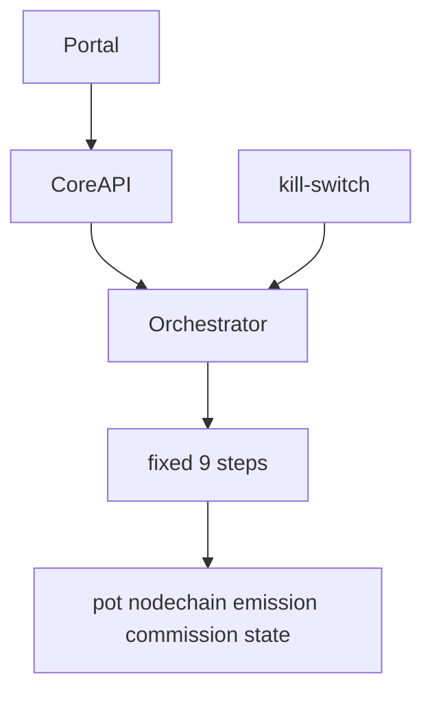
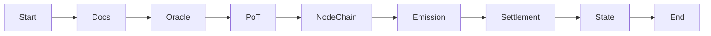
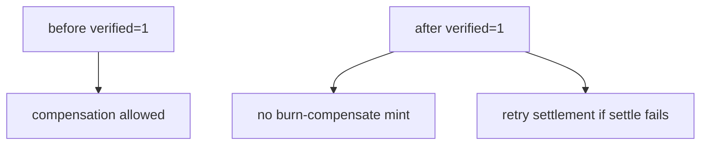

# DIAGRAM — `orchestrator`

## Sole economic entry

```mermaid
flowchart TB
  Portal --> CoreAPI --> Orch[Orchestrator]
  Orch --> Pipeline[fixed 9 steps]
  Pipeline --> Modules[pot nodechain emission commission state]
  Kill[kill-switch] --> Orch
```

## Pipeline detail

```mermaid
flowchart LR
  Start --> Docs --> Oracle --> PoT --> NodeChain --> Emission --> Settlement --> State --> End
```

## Saga boundary

```mermaid
flowchart TB
  Pre[before verified=1] --> Comp[compensation allowed]
  Post[after verified=1] --> NoComp[no burn-compensate mint]
  Post --> Retry[retry settlement if settle fails]
```
