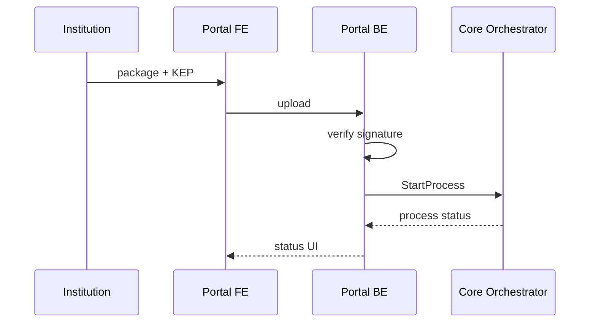
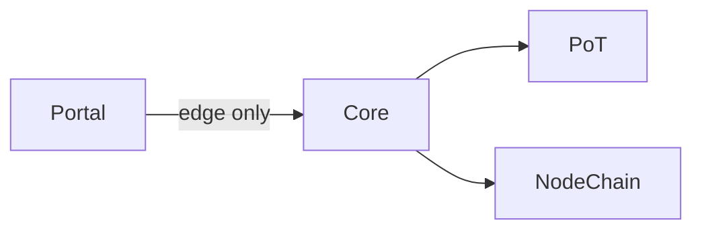

# DIAGRAM — `portal`

## Edge architecture

```mermaid
flowchart TB
  UI[Next.js frontend] --> BE[Nest edge backend]
  BE -->|KEP check| Docs[document upload]
  BE -->|economic| Core[/v1/core Orchestrator]
  BE -.->|must not| Val[invent valuation]
```

## User flow tokenize



## Boundary


