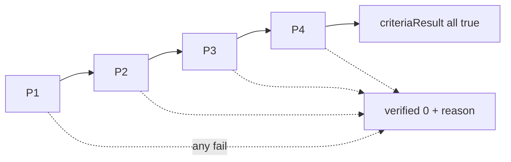
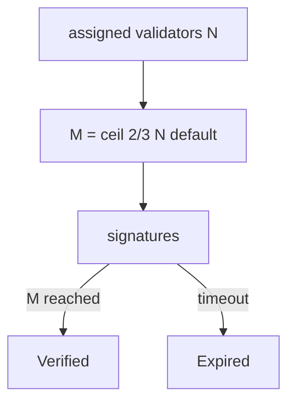

# DIAGRAM — `pot-engine`

## Module boundary

```mermaid
flowchart TB
  subgraph pot_engine
    Evidence[evidence model]
    Criteria[P1-P4]
    Quorum[M-of-N]
    Verdict[verified 0|1]
  end
  Evidence --> Criteria --> Quorum --> Verdict
  Verdict --> NC[src/nodechain]
  Verdict --> Em[src/emission ok signal]
  Orch[src/orchestrator] --> pot_engine
```

## Criteria all-pass



## Quorum


