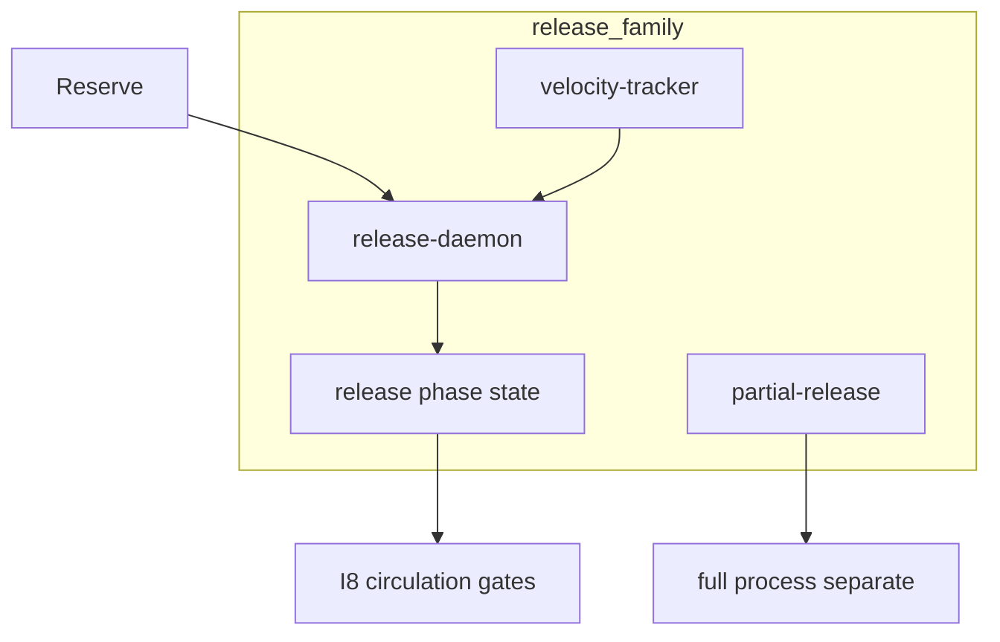
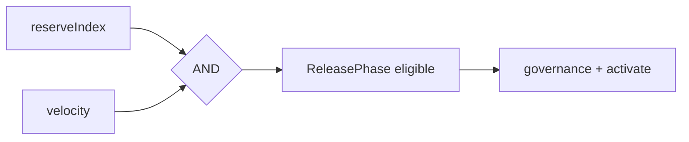
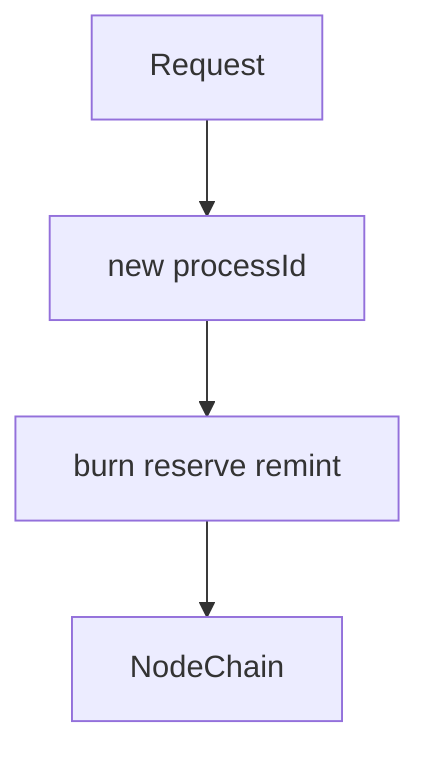

# DIAGRAM — `release`

## Release family

```mermaid
flowchart TB
  subgraph release_family
    Phase[release phase state]
    Daemon[release-daemon]
    Vel[velocity-tracker]
    Partial[partial-release]
  end
  Reserve --> Daemon
  Vel --> Daemon
  Daemon --> Phase
  Partial --> Orch[full process separate]
  Phase --> Gates[I8 circulation gates]
```

## Phase formula

```mermaid
flowchart LR
  RI[reserveIndex] --> AND{AND}
  V[velocity] --> AND
  AND --> Eligible[ReleasePhase eligible]
  Eligible --> Gov[governance + activate]
```

## Partial path

```mermaid
flowchart TB
  Request --> Process[new processId]
  Process --> Atomic[burn reserve remint]
  Atomic --> NC[NodeChain]
```
