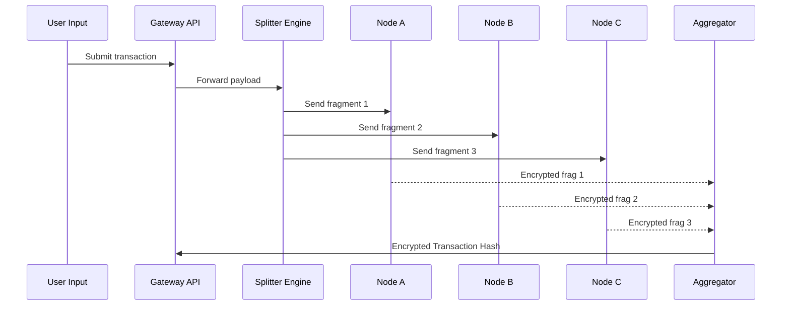

# Encryption Protocol (NodeChain Security Layer)

## 🎯 Purpose of This Document

This document describes the encryption model used within AST's NodeChain to ensure secure, trustless, and non-extractable transaction processing. The focus is on distributed partial encryption, dynamic node participation, and zero-knowledge isolation between processing nodes.

---

## 🔐 Core Principles

1. **Partial Fragment Encryption**
   - Each transaction is divided into N independent fragments.
   - Each fragment is encrypted by a different node.
   - No single node sees the full transaction.

2. **Trustless Zero-Knowledge**
   - Nodes do not have access to the original data.
   - They only receive the part they are responsible to encrypt.

3. **Probabilistic Node Assignment**
   - Nodes are selected pseudo-randomly from eligible pools.
   - Selection based on rotation, reputation, and system load.

4. **No Permanent Storage**
   - Encrypted fragments are never stored post-processing.
   - Memory is flushed and hash-confirmed after confirmation.

---

## 🧩 Encryption Workflow (Simplified)

---

## **⚙️ Encryption Stack**

| **Layer** | **Description** |
| --- | --- |
| Payload Split | Pre-encryption segmentation by payload type |
| Dynamic Salt | Time-bound salt generation per fragment |
| Node Cipher | AES-512 w/ adaptive round key policies |
| Aggregation | Hash + timestamped commit to transaction chain |

---

## **🔁 Node Eligibility Rules**

- Minimum uptime: 92%
- Past encryption integrity score > 85%
- No participation in prior round (rotation rule)
- Hardware compatibility with E2E cryptography

---

## **🔍 Example: Encrypted Payload Metadata**

{
  "fragments": 3,
  "nodes_used": ["node_314", "node_442", "node_127"],
  "encryption_method": "AES-512",
  "fragment_hashes": [
    "0x98fa...",
    "0xab76...",
    "0xc310..."
  ],
  "final_transaction_hash": "0xf94cd3..."
}

---

## **📁 Repository Location**

ast/
└── 03_security_layer/
    └── encryption_protocol.md
