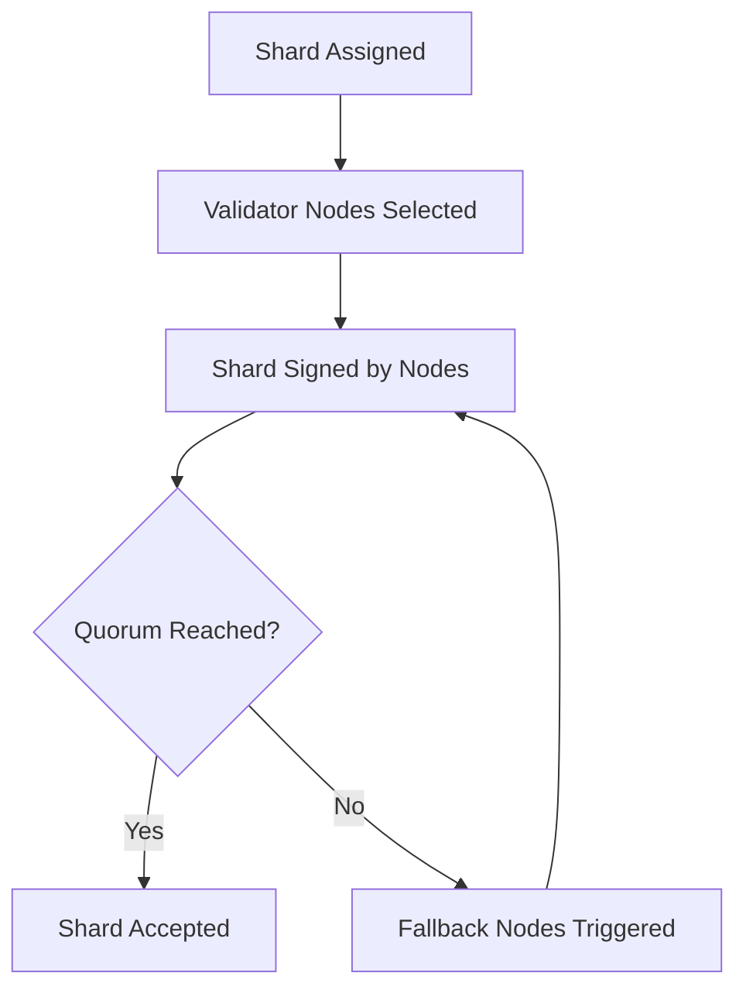

# Shard Quorum Protocol

## 🎯 Purpose of This Document

This document defines the quorum-based validation process required for a transaction shard to be accepted as valid within the NodeChain ecosystem. It describes node consensus logic, fault tolerance, quorum thresholds, and fallback mechanisms.

---

## 🧩 Core Objectives

1. Establish **minimum quorum rules** for shard acceptance.
2. Handle **node faults** and dynamic reallocation.
3. Ensure **consensus is reached** before shard inclusion.
4. Provide fallback routing in case of insufficient quorum.

---

## 🔁 Quorum Threshold Definition

- Minimum required nodes per shard: `3`
- Recommended maximum: `7` (to reduce latency)
- Dynamic quorum adjustment based on:
  - Network load
  - Node health
  - Transaction priority

---

## 🧠 Node Roles

- **Validator Node**: Participates in shard signing.
- **Fallback Node**: Only called if a validator fails.
- **Quorum Manager**: Tracks signature collection status.

---

## 🔐 Shard Acceptance Conditions

A shard is accepted into the transaction body if:

- At least `N` validator nodes have signed it.
- All signatures are cryptographically valid.
- Signature timestamps are within the allowed window.
- No validator is flagged for misconduct.

---

## 🔄 Fallback Mechanism

If quorum is not reached within `X` seconds:

1. Trigger `quorum_recovery()`
2. Replace inactive validators with fallback nodes
3. Restart shard signing process

---

## 🧬 Consensus Flow



---

## **📊 Example Quorum Matrix**

| **Shard** | **Node_01** | **Node_02** | **Node_03** | **Node_04** | **Quorum** |
| --- | --- | --- | --- | --- | --- |
| A | ✅ | ✅ | ❌ | ✅ | ✅ |
| B | ✅ | ❌ | ✅ | ❌ | ❌ |

---

## **🚨 Handling Node Misbehavior**

If a node:

- Fails to respond multiple times → Temporary ban
- Submits invalid signatures → Permanent blacklist
- Abuses fallback quota → Logged to security_log

---

## **📁 Repository Location**

```
ast/
└── 02_nodechain_engine/
    └── shard_quorum_protocol.md
```
