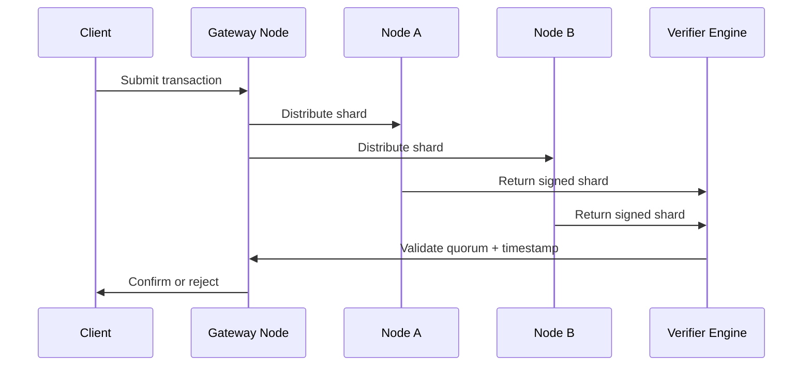

# Shard Validation Protocol

## 🎯 Purpose of This Document

This document outlines the validation mechanism for transaction shards processed across decentralized nodes within the AST NodeChain Engine. It defines rules for signature consensus, time alignment, quorum voting, and integrity verification.

---

## 🧩 Core Objectives

1. Define the **validation flow** for shard generation and confirmation.
2. Establish **minimum quorum rules** for shard legitimacy.
3. Standardize **signing format**, time-lock validation, and consensus logic.
4. Ensure **tamper-resistance** of all approved shards.
5. Support **parallel validation** and horizontal scalability.

---

## 🔄 Validation Lifecycle



---

## **✅ Quorum Rules**

- A shard is considered **valid** only if:
    - It receives a minimum of Q independent node signatures (e.g. Q = 2/3 of K).
    - Timestamps from participating nodes differ by no more than ΔT seconds (e.g. 3s).
    - The hash of each node’s shard matches across signatories.

```
{
  "shard_id": "shd-8821",
  "valid_signatures": 4,
  "quorum_required": 4,
  "time_delta_max": 3,
  "status": "valid"
}
```

---

## **🔐 Signature Format**

Each node signs its shard portion using ECDSA over secp256k1:

```
{
  "shard_id": "shd-1394",
  "signature": "0x3045022100ab...cd90",
  "node_id": "node-eu-03",
  "signed_at": "2025-06-23T17:55:00Z"
}
```

All signature bundles are stored temporarily during quorum confirmation.

---

## **📏 Hash Integrity Check**

All validated shards must:

- Match an identical **SHA-256 hash** across signatory nodes.
- Reject validation if even one node returns a mismatched digest.
- Be flagged and requeued if mismatch occurs.

---

## **⚙️ Parallelism and Load Strategy**

- Nodes are grouped into **validation pools**.
- Parallel quorum groups reduce latency.
- The Gateway manages shard distribution using a **load-aware round-robin** algorithm.

---

## **📁 Repository Location**

```
ast/
└── 02_nodechain_engine/
    └── shard_validation_protocol.md
```
