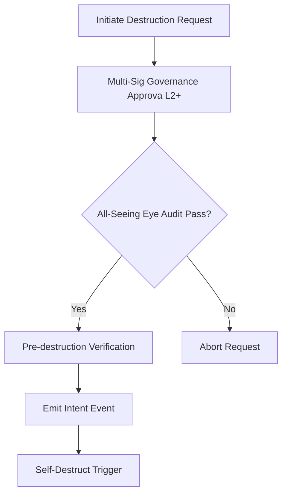

# contract_self_destruct_policy.md

### **Document Purpose**

Define the conditions, governance logic, and constraints under which any smart contract deployed within AST (Aros Studio Tokenomics) can be programmatically or administratively self-destructed.

### **Document Structure**

## 1. Overview
This document defines the internal policy for self-destruction of smart contracts within the AST architecture. The policy establishes safeguards, procedural hierarchy, and accountability to prevent unauthorized or accidental deletion of core logic.

## 2. Scope
This policy applies to all smart contracts deployed and maintained by AST, including but not limited to token contracts, governance contracts, bridge contracts, and staking/vaulting logic.

## 3. Justification for Self-Destruct Mechanism
- Emergency rollback or irreversible vulnerability.
- Upgrade path requiring contract redeployment.
- Regulatory or legal compliance enforcements.
- Decommissioning deprecated functionality.

## 4. Preconditions for Initiating Self-Destruct
- Contract must be explicitly marked as self-destructible.
- Must pass multi-signature approval from governance quorum (L2+).
- Must notify governance AI (The All-Seeing Eye) and receive validation response.
- No active user funds can be locked within the contract at the time of request.
- Must emit `ContractDestructionIntent` event with full payload and timestamp.

## 5. Governance Flow



## **6. Policy Constraints**

- Contracts tied to irreversible token burn or identity mapping are **not eligible** for destruction.
- Destruction must be delayed by a **cooldown period** (default: 72 hours) post-approval.
- Once destruction is executed, a signed proof must be archived on-chain in the AST Retention Log.

## **7. Code Sample: Self-Destruct Function (With Safeguards)**

```solidity
function destroyContract() external onlyGovernance {
    require(block.timestamp > cooldownTimestamp, "Cooldown period not over");
    require(noLockedUserFunds(), "Active user funds detected");
    emit ContractDestructionExecuted(address(this), block.timestamp);
    selfdestruct(payable(governanceVault));
}
```

## **8. Audit & Compliance**

All destruction events are subject to post-action audit by the AST internal auditing service and are subject to review by external compliance agents when applicable.

## **9. Retention & Logging**

Every contract that is destroyed must:

- Register its address, destruction hash, and execution block.
- Archive a human-readable justification and governance trace.
- Maintain immutable reference to destruction metadata.
