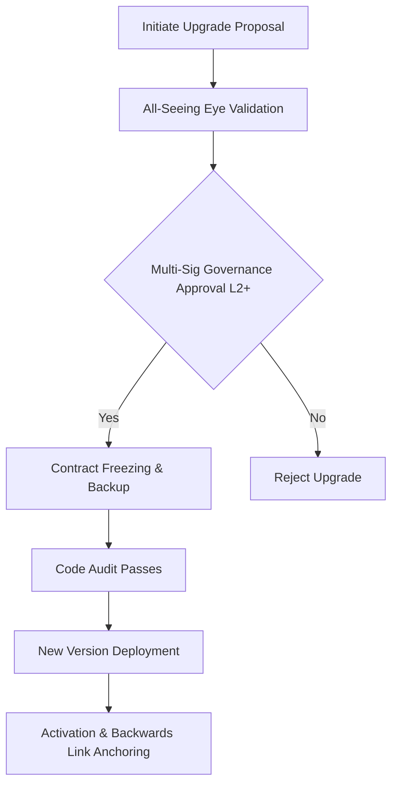

# smart_contract_upgrade_policy.md

### **Document Purpose**

Define the upgrade procedures, constraints, and validation flow for all smart contracts deployed in the AST system, ensuring backwards compatibility, traceability, and protocol stability.


## 1. Overview
This document outlines the internal upgrade policy for smart contracts operating within the AST ecosystem. It ensures protocol stability while allowing for iterative evolution and patching of logic without compromising the decentralized trust layer.

## 2. Scope
Covers all upgradable smart contracts under AST governance, including:
- Token contracts (ARO, ARO-X, etc.)
- Governance and access control contracts
- Bridge and inter-chain wrappers
- Vaults and staking logic

## 3. Upgrade Justifications
Upgrades may be initiated for:
- Patch-level security fixes
- Protocol logic changes reflecting updated business rules
- Compliance alignment (regulatory or KYC/AML)
- Performance or gas cost optimization
- Compatibility with updated AST modules or Aros NodeChain versions

## 4. Upgrade Flow (Governance-based)




## **5. Constraints**

- Upgrade must not affect irreversible ledger states.
- No upgrade can modify internal balances or user vaults.
- Governance signature threshold must meet defined quorum level.
- All upgrades must emit a ContractUpgradeIntent event with metadata.

## **6. Compatibility Layering**

Each upgraded contract must:

- Maintain ABI compatibility or version-specific wrappers.
- Anchor reference to previous contract hash and version tag.
- Be retroactively auditable via AST Retention Registry.

## **7. Code Sample: Upgrade Hook**

```
event ContractUpgradeIntent(address indexed oldVersion, address indexed newVersion, uint256 timestamp);

function upgradeTo(address newImplementation) external onlyGovernance {
    require(newImplementation != address(0), "Invalid implementation");
    emit ContractUpgradeIntent(address(this), newImplementation, block.timestamp);
    _upgradeTo(newImplementation);
}
```

## **8. Post-Upgrade Verification**

- All upgrades are subject to mandatory post-activation audit.
- Previous version contracts must be archived and disabled.
- Upgrade logs must be stored on-chain under AST_UpgradeLedger.

## **9. Retention & Versioning**

- Maintain full lineage of contract versions with timestamped justification.
- Store upgrade hashes, governance trace, and human-readable changelogs.
