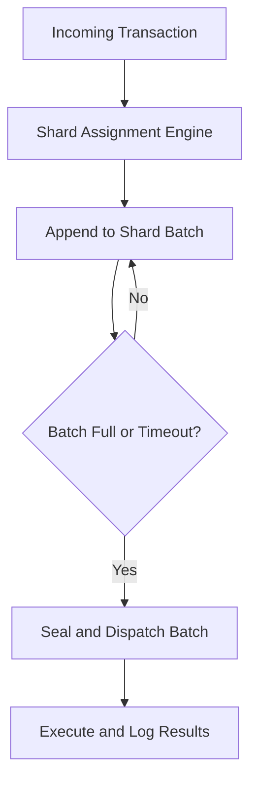

# tx_batching_and_sharding.md

## Module: Transaction Batching & Sharding
- **Layer**: Processing Layer — AST (Aros Studio Tokenomics)
- **Status**: Production-grade
- **Author**: Aros Studio NodeChain Division
- **Last Updated**: 2025-07-05

---

## Overview

The `tx_batching_and_sharding` module defines how transactions are grouped, partitioned, and processed in parallel within the AST architecture to ensure scalability, performance, and jurisdictional separation. Batching allows for efficient state commits and block synchronization. Sharding enables transaction processing to be distributed across logical or physical domains (such as geographic zones, emission pools, or node clusters).

Together, these mechanisms form the backbone of AST’s horizontal scaling model.

---

## Purpose

- Improve throughput via parallel transaction processing
- Minimize latency by isolating execution domains
- Reduce block size overhead by committing transactions in optimized batches
- Support jurisdictional and regulatory isolation
- Enable validator load balancing and emission control by shard

---

## Batching Logic

| Rule                             | Description                                               |
|----------------------------------|-----------------------------------------------------------|
| Max batch size                   | 512 transactions (default; adjustable per policy)         |
| Commit interval                  | Every 4 seconds (or after batch fills)                    |
| Same-token grouping              | Transactions using same token are grouped where possible |
| Risk-aware sorting               | High-risk TXs are batched separately                      |
| Fee Distribution-coherent batching       | Only one emission trigger per batch is allowed            |
| Failure containment              | One failed TX does not invalidate the full batch          |

---

### Sample Batch Payload

```json
{
  "batch_id": "BATCH-17432",
  "shard_id": "SH-04",
  "timestamp": 1720251001,
  "tx_count": 238,
  "tx_ids": ["TX-001", "TX-002", "..."],
  "risk_profile": "medium",
  "emission_flagged": true
}

```

---

## Sharding Model

Shards represent logical partitions of the system. Each shard operates its own isolated:

- **State snapshot context**
- **Validator queue**
- **Batching mechanism**
- **Fee Distribution buffer**
- **Audit and hash logs**

Shards may be defined by:

- **Geography** (e.g., EU, APAC, US)
- **Token ID prefix** (e.g., AROS-001 → SH-01)
- **Risk domain** (e.g., high-risk → SH-X)
- **Business logic role** (e.g., marketplace vs treasury)

---

### Example Shard Definition

```json
{
  "shard_id": "SH-EU-01",
  "jurisdiction": "EU",
  "token_scope": ["AROS-0001" to "AROS-0999"],
  "validators": ["ND-12", "ND-15"],
  "emission_ceiling": 1000000
}

```

---

## Processing Flow

1. Incoming TX assigned to shard via routing engine
2. Shard appends TX to active batch (if within policy)
3. Once batch fills or time expires, it's sealed
4. Sealed batch dispatched to execution engine
5. Results journaled and hash mapped per shard
6. Fee Distribution logic applied if conditions met

---

## Mermaid Diagram



---

## Shard Synchronization & Failover

- Each shard maintains its own consensus snapshot
- Cross-shard consistency is ensured via Merkle diffing
- Failed shards are quarantined and failover nodes activated
- Fee Distribution caps are shard-specific and enforced by validator quorum

---

## Integration Points

| Module | Role |
| --- | --- |
| `tx_dispatch_engine` | Routes transactions into proper batch and shard |
| `tx_state_snapshot_hook` | Manages per-shard state isolation |
| `tx_journal_writer` | Logs batch ID and shard context |
| `tx_validation_pipeline` | May trigger cross-shard integrity checks |
| `PoT_Attestation_Engine` | Computes shard-local and global emission trace hashes |

---

## Developer Notes

- Batching engine runs on async thread to avoid execution blocking
- Shard definitions are policy-driven and hot-reloadable
- Batches should be persisted before dispatch in case of crash recovery
- Fee Distribution logic must include shard prefix in traceable hash to avoid collisions

---

## Version History

| Version | Date | Changes |
| --- | --- | --- |
| 1.0 | 2025-07-05 | Initial batching/sharding logic defined |

---
