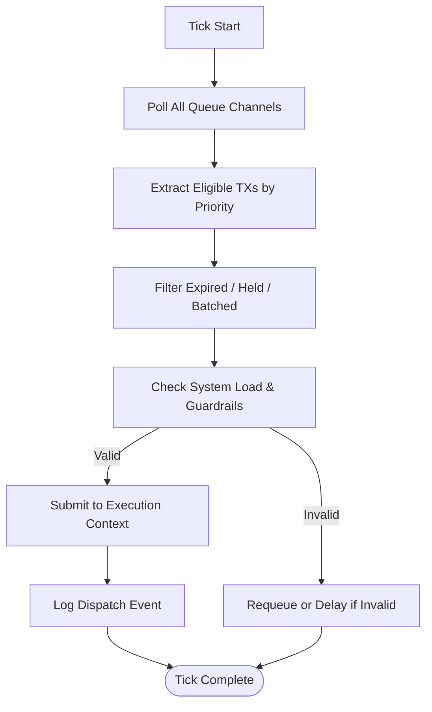

# tx_dispatch_engine.md 

## 1. Purpose

This document describes the **transaction dispatch engine** — the component responsible for moving transactions from the internal queue to the execution layer.
It implements deterministic selection, channel-aware scheduling, and concurrency-safe handover to isolated execution environments.

---

## 2. Dispatch Goals

The dispatch engine must:

- Maintain fairness across all queue channels
- Respect transaction priority and TTL
- Support controlled parallel execution
- Guarantee isolation and reproducibility
- Prevent starvation or stuck states

---

## 3. Dispatch Loop Design

The dispatch engine runs as an **infinite looped scheduler**, operating in ticks (e.g. 50ms intervals).

### At each tick:
1. Poll all queue channels
2. Extract top-priority eligible TXs
3. Filter expired, blocked, or held TXs
4. Submit TXs to available execution contexts

The engine may skip idle channels and promote starving queues if fairness mode is active.

---

## 4. Channel Scheduling Strategy

Each queue channel has a **dispatch weight** based on:

- `channel_priority_score`
- `recent throughput`
- `pending_critical_tx_count`

Example schedule (tick window: 8 slots):

```text
normalized_tx/      → 3 slots
internal_contracts/ → 2 slots
token_ops/          → 2 slots
governance/         → 1 slot

```

Weights are recalculated dynamically using exponential decay scoring.

---

## 5. Dispatch Criteria

To be dispatched, a transaction must:

- Not be in Hold State
- Have valid TTL
- Be executable under current system load
- Not conflict with ongoing locks (checked via `tx_execution_guardrails`)

If a transaction fails these, it is requeued or delayed.

---

## 6. Hand-off to Execution Context

Selected TXs are submitted to **execution contexts** (see next doc), which may be:

- Sandboxed virtualized workers
- Dedicated processing threads
- Stateless isolated containers

Dispatch engine handles:

- Resource token assignment
- Lock registration
- Execution receipt awaiting

---

## 7. Failure Handling

If dispatch fails (e.g. crash in hand-off):

- Transaction is marked `dispatch_failed`
- Requeued with `retry_delay_ms`
- Error logged with cause trace

If failure count exceeds threshold, the TX is quarantined.

---

## 8. Concurrency and Safety

To prevent race conditions:

- Each queue channel has a dispatch mutex
- Execution context pool is managed with a bounded semaphore
- All hand-off actions are logged with monotonic timestamps

---

## 9. Summary

The dispatch engine ensures reliable, predictable, and high-integrity movement of transactions from internal queues to execution environments.

It is the central scheduler that balances throughput, safety, and fairness across all processing flows.

---



This diagram visualizes one iteration of the **dispatch loop**, executed at fixed tick intervals (e.g. 50ms).

Each loop ensures safe, fair, and isolated progression of eligible transactions into the execution layer.

### 🔧 `dispatch_weights.toml` — Example Configuration

```toml
# Weight configuration for dispatch scheduling
[channel_weights]

# Normal user transactions
normalized_tx = { weight = 3, decay_factor = 0.9 }

# Internal contract calls
internal_contracts = { weight = 2, decay_factor = 0.95 }

# Token-related operations
token_ops = { weight = 2, decay_factor = 0.92 }

# Governance-related operations
governance = { weight = 1, decay_factor = 0.98 }

[settings]
tick_interval_ms = 50
max_slots_per_tick = 8

```

> These weights are dynamically recalculated based on historical throughput, starvation rate, and pending critical TXs.
> 
> 
> Exponential decay is used to adapt over time while ensuring responsiveness.
> 

---

### 📜 Dispatch Event Log — Example

```json
{
  "tick": 438492,
  "timestamp": "2025-06-23T22:01:41.118Z",
  "dispatched": [
    {
      "tx_id": "0xA294...F6C1",
      "channel": "token_ops",
      "context_id": "ctx_0993f",
      "priority_score": 827,
      "result": "submitted"
    },
    {
      "tx_id": "0x9910...B38D",
      "channel": "internal_contracts",
      "context_id": "ctx_0993e",
      "priority_score": 692,
      "result": "submitted"
    }
  ],
  "requeued": [
    {
      "tx_id": "0xFFAC...23A2",
      "reason": "expired_ttl"
    }
  ]
}

```

> Every dispatch tick logs successful hand-offs, requeues, and reasons for fallback. These logs are system-internal and not exposed to users or external interfaces.
> 

---

### ⚙️ Advanced Dispatch Policies

The dispatch engine supports overrides and advanced routing:

- **Channel Exclusion Mode** — Temporarily disable specific channels under congestion.
- **Emergency Drain Trigger** — Force-dispatch from critical queues (e.g. governance).
- **Context-Affinity Binding** — Lock specific types of TXs to specific execution pools.
- **Override Rules via Policy Engine** — Allow external signal (e.g. chain emergency state) to modify dispatch weights in real time.

These policies are applied **post-weight-calculation**, just before final slot assignment.

---

### 📈 Future Improvements

Areas for upcoming refinement:

- **Async Dispatch Scheduling** — move to event-driven signal-loop instead of tick-loop.
- **Predictive Load Balancing** — forecast queue congestion and preemptively rebalance.
- **Zero-Copy Hand-off** — reduce context-switch latency via memory sharing.
- **External Policy Integration** — allow governance contracts to influence weights dynamically.

---
