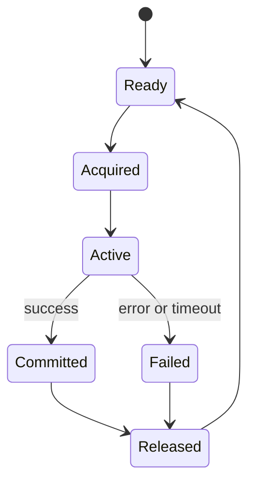

# tx_execution_contexts.md

## 1. Purpose

This document defines the structure and behavior of **Transaction Execution Contexts (TXEC)** in the AST system.
Execution contexts are isolated runtime containers that receive transactions after they are dispatched, providing deterministic, resource-bounded environments for secure execution.

TXECs are the final step in the **Processing Layer** pipeline:


Their function is to enforce:

- full **state separation**,
- strict **resource control**,
- **deterministic execution**,
- and **fail-safe state commitment**.

---

## 2. Execution Context Types

AST supports three core execution context types. The context engine selects the appropriate type dynamically, based on the TX characteristics and load conditions.

| Type | Runtime Profile | Use Case |
| --- | --- | --- |
| `lightweight_vm` | In-process sandbox (JIT/V8/WASM) | Fast smart contract calls |
| `native_worker` | OS thread with limited syscall | System-level or heavy TXs |
| `containerized` | Isolated microkernel/WASM VM | Secure, auditable, full-state TXs |

> The context pool includes all three types, and a scheduler maps transactions to appropriate containers on-demand.
> 

---

## 3. Context Lifecycle

Each execution context goes through a well-defined lifecycle:



| Phase | Description |
| --- | --- |
| `Ready` | Idle context in pool, available for assignment |
| `Acquired` | Locked by dispatcher, pending TX load |
| `Active` | Executing transaction in isolated runtime |
| `Committed` | Execution success, state changes recorded |
| `Failed` | TX execution failed, state reverted |
| `Released` | Context reset and returned to pool |

Each context has a unique `context_id` and is tracked via internal monitoring.

---

## 4. Execution Flow

The step-by-step logic for transaction execution inside a context:

1. **TX Load** — Transaction payload is loaded into the assigned context.
2. **Runtime Bootstrap** — Init variables: sender, contract scope, balances, nonce.
3. **Instruction Execution** — TX is executed step-by-step.
4. **Gas Measurement** — Gas usage is computed in real time.
5. **State Isolation** — Changes are sandboxed until commit.
6. **Commit or Rollback**:
    - On success: commit state and emit receipt.
    - On failure: rollback all changes.
7. **Context Recycle** — Context is reset and returned to pool.

---

## 5. Context Isolation Rules

Execution contexts are strictly isolated to ensure secure, reproducible, and tamper-proof behavior.

The following rules are enforced at the engine level:

- **Memory Isolation**
    
    No shared memory is allowed across contexts. Each TX runs in a clean memory space, fully cleared after use.
    
- **No External Communication**
    
    Contexts are not allowed to initiate or accept any external I/O, network requests, or system calls.
    
- **Deterministic Time & Randomness**
    
    All time and random values are injected from the deterministic runtime layer. No system clock or entropy is exposed.
    
- **Execution Timeout**
    
    A hard cap (`tx_exec_timeout_ms`) is applied per TX. Overruns trigger termination and rollback.
    
- **No Parallelism**
    
    Execution within a context is single-threaded. Multi-threaded operations are disallowed by policy.
    
- **Immutable Runtime State**
    
    Runtime parameters (e.g., gas price, block height) are snapshot at TX load and cannot change mid-execution.
    

---

## 6. Resource Constraints

Each execution context is provisioned with strict resource boundaries:

| Resource | Description |
| --- | --- |
| `cpu_time_ms` | Maximum wall-clock time allocated to TX execution |
| `memory_mb` | Memory ceiling per TX context |
| `gas_units` | Max gas limit enforced by runtime |
| `instr_count` | Maximum allowed instructions (to prevent infinite loops) |

If any of these constraints are breached:

- Execution is immediately halted,
- Context is marked as `Failed`,
- All changes are discarded (rollback),
- A fault log is generated and indexed.

---

## 7. Execution Failure Modes

Failures during execution are explicitly categorized and logged for audit and debug:

| Failure Type | Description |
| --- | --- |
| `gas_exhausted` | TX consumed more gas than allowed |
| `timeout` | TX exceeded time cap |
| `invalid_opcode` | Execution attempted illegal instruction |
| `memory_overflow` | TX exceeded its memory allocation |
| `logic_exception` | Smart contract logic error (e.g., divide-by-zero) |
| `external_call_blocked` | Forbidden system call or I/O attempt |

All failures trigger full rollback. Context isolation guarantees that no partial state is leaked.

---

## 8. Logging and Receipts

Each execution context produces a **TX Receipt**, which contains:

```json
{
  "tx_id": "0xA85F2B...",
  "context_id": "ctx_2381",
  "status": "success",
  "exec_time_ms": 19,
  "gas_used": 31482,
  "memory_peak_mb": 22.3,
  "state_diff": {
    "accounts": { "...": "..." },
    "contracts": { "...": "..." }
  },
  "logs": [
    "ContractEmitted:0xA...0F",
    "Transfer:0xA -> 0xB : 12.5 AROS"
  ],
  "revert_reason": null
}

```

Receipts are:

- written to `tx_journal_writer`,
- indexed by `tx_hash_map_index`,
- optionally linked to contract-level audit chains.

---

## 9. Future Extensions

Planned improvements and enhancements for Execution Contexts:

- **Hybrid Context Model** — merge VM and container models for dynamic optimization.
- **Adaptive Gas Benchmarking** — per-TX adaptive gas scaling based on execution history.
- **Context Reuse Pools** — warm-pooling of initialized WASM VMs for lower latency.
- **Proof-of-Execution Anchors** — cryptographic proof of TX run (optional).
- **Shared Memory Zones (Restricted)** — future zero-copy intercontract call support.

---

## 10. Summary

AST’s execution contexts provide a tightly controlled, deterministic, and reproducible environment for processing both smart and system-level transactions.

They are the final isolation and enforcement mechanism in the transaction pipeline and enable:

- precise gas tracking,
- full rollback support,
- audit-traceable receipts,
- and high-security state mutation.

Execution Contexts are core to the AST Processing Layer's resilience, scalability, and trustworthiness.
