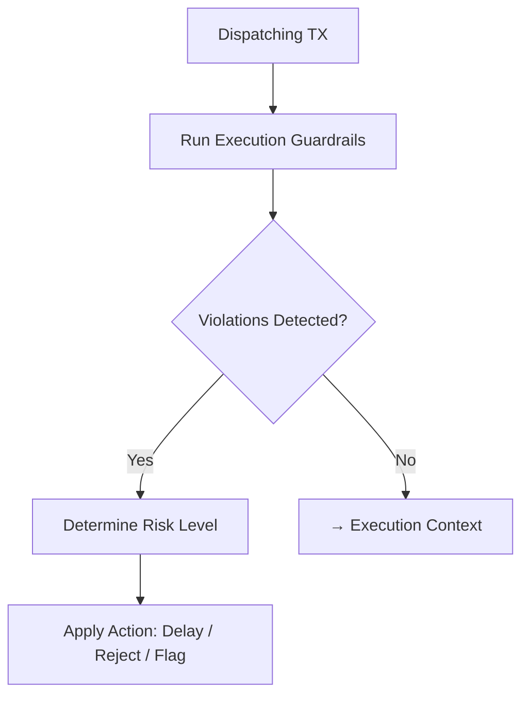

# tx_execution_guardrails.md

## Module: Transaction Execution Guardrails
- **Layer**: Processing Layer — AST (Aros Studio Tokenomics)
- **Status**: Production-grade
- **Author**: Aros Studio NodeChain Division
- **Last Updated**: 2025-07-05

---

## Overview

The `tx_execution_guardrails` module provides a runtime safety layer for executing transactions inside the AST architecture. Unlike pre-validation checks, this system operates during or immediately before the dispatch phase, serving as a dynamic filter that can block, reroute, delay, or flag transactions in real time based on internal risk criteria, policy states, and context violations.

It exists to **prevent critical failures, abuse, or state corruption**, and acts as a final firewall before state mutation begins.

---

## Purpose

- Prevent execution of malicious or high-risk transactions
- Enforce runtime policy rules and emergency stops
- Detect anomalous patterns not caught during initial validation
- Protect internal ledger coherence and emission consistency
- Coordinate jurisdictional and actor-specific restrictions

---

## When Guardrails Are Triggered

Guardrails may activate under the following scenarios:

| Scenario                          | Triggered Action             |
|-----------------------------------|-------------------------------|
| High transaction velocity         | Delay + log transaction       |
| Sudden token burst                | Batch + alert admin node      |
| Transaction below risk threshold | Proceed                       |
| Execution path anomaly            | Redirect to simulation mode   |
| Fee Distribution policy breach            | Reject + freeze token ID      |
| Node time desync > 3s             | Queue in holding tank         |
| Unauthorized jurisdiction         | Full rejection                |

---

## Runtime Architecture

1. Transaction enters `tx_dispatch_engine`
2. Guardrail module listens on parallel execution path
3. Pre-commit hook verifies runtime conditions
4. If violations are detected, one of the following is applied:
   - Reject
   - Delay
   - Simulate
   - Re-route
   - Report
5. Else → pass to execution context

---

## Mermaid Diagram



---

## Actions & Effects

| Action | Description |
| --- | --- |
| **Reject** | Immediate rejection with error code + log |
| **Delay** | TX moved to a lower priority batch with timestamp |
| **Redirect** | TX sent to `tx_simulation_mode` for shadow run |
| **Flag** | TX marked in journal for forensic tracking |
| **Freeze** | Affected token or wallet temporarily locked |

---

## Sample Error Response

```json
{
  "tx_id": "TX-7743-RISK",
  "status": "rejected",
  "error": {
    "code": "EMISSION_GUARDRAIL_BREACH",
    "message": "Fee Distribution quota exceeded for token AROS-041"
  },
  "timestamp": 1720249442,
  "guardrail_trigger": true
}

```

---

## Integration Points

This module interfaces directly with:

- `tx_dispatch_engine` — to intercept prior to state commit
- `tx_validation_pipeline` — may reinforce rejected decisions
- `tx_simulation_mode` — used for redirect of risky paths
- `tx_failure_modes` — to map rejection reasons
- `tx_audit_log_format` — logs all guardrail actions with full metadata

---

## Configuration

Guardrail rules are defined via configuration schemas and may be adjusted without code redeployment. Each rule includes:

```json
{
  "rule_id": "GR-0032",
  "match": {
    "token_id": "AROS-*",
    "velocity": "> 10 tx/sec",
    "jurisdiction": "restricted"
  },
  "action": "reject",
  "severity": "critical"
}

```

Rules are version-controlled, timestamped, and auditable.

---

## Security Notes

- Guardrail logic cannot be bypassed from user inputs or external API.
- Admin-level changes to rules are multi-signature gated.
- Every triggered guardrail is logged with:
    - Node ID
    - Timestamp
    - Hash of transaction
    - Rule ID
    - Suggested mitigation
- Guardrail records are protected under `tx_audit_log_format` and immutable once committed.

---

## Developer Notes

- Guardrails operate **after validation** but **before execution**.
- No rollback logic needed; blocked transactions never mutate state.
- Stateless by design, but can cache node-local indicators for velocity and frequency analysis.

---

## Version History

| Version | Date | Notes |
| --- | --- | --- |
| 1.0 | 2025-07-05 | Initial guardrail logic added |

---

```

---

Если всё окей — говори **“Подтверждаю”**, и двигаемся дальше: к `tx_state_snapshot_hook.md`.
```
