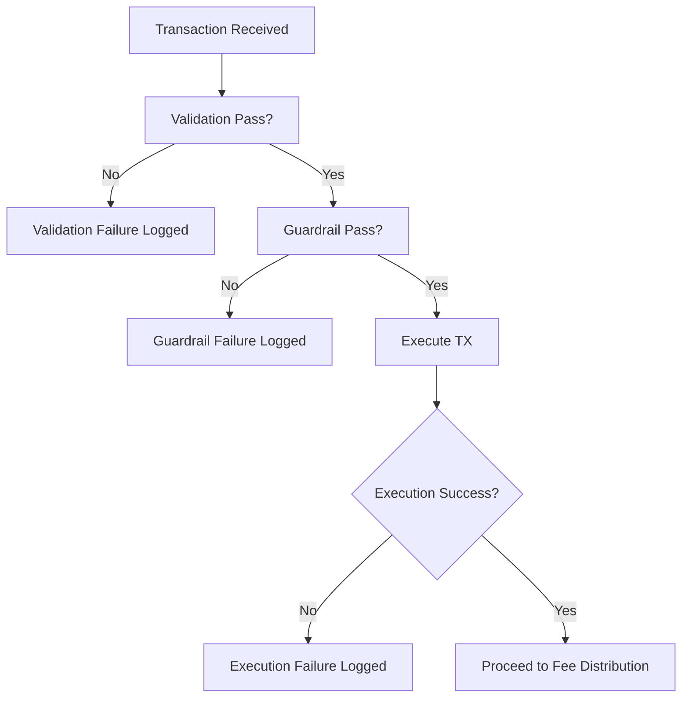

# tx_failure_modes.md

## Module: Transaction Failure Modes
- **Layer**: Processing Layer — AST (Aros Studio Tokenomics)
- **Status**: Production-grade
- **Author**: Aros Studio NodeChain Division
- **Last Updated**: 2025-07-05

---

## Overview

The `tx_failure_modes` module defines a comprehensive taxonomy and structured handling mechanism for transaction failures within the AST system. It allows deterministic categorization, logging, escalation, and remediation of any transaction that does not reach the execution or emission phase.

This module is critical for system auditability, error recovery, rollback triggers, and long-term statistical modeling of fault patterns across nodes.

---

## Failure Mode Categories

Failure modes are grouped into five high-level categories:

| Category         | Description                                                   |
|------------------|---------------------------------------------------------------|
| **Validation**   | Transaction fails schema, signature, or logical checks        |
| **Guardrail**    | Transaction blocked by real-time runtime conditions           |
| **Simulation**   | Transaction produces invalid output under dry-run             |
| **Execution**    | Error during actual state mutation (rare, fatal)              |
| **System**       | Infrastructure or snapshot-related failures                   |

---

## Canonical Error Codes

| Code                         | Type         | Description                                                 |
|------------------------------|--------------|-------------------------------------------------------------|
| `INVALID_FIELD_FORMAT`       | Validation   | Malformed field in input structure                          |
| `MISSING_REQUIRED_FIELD`     | Validation   | Required field is absent                                    |
| `SIGNATURE_VERIFICATION_FAILED` | Validation | Invalid or tampered digital signature                       |
| `INSUFFICIENT_BALANCE`       | Validation   | Not enough funds for transfer                               |
| `TOKEN_FROZEN_OR_EXPIRED`    | Guardrail    | Token currently blocked from movement                       |
| `EMISSION_GUARDRAIL_BREACH`  | Guardrail    | Attempt to mint beyond policy quota                         |
| `SIMULATION_FAILED`          | Simulation   | Dry-run revealed invalid execution path                     |
| `STATE_MUTATION_ERROR`       | Execution    | State could not be committed safely                         |
| `SNAPSHOT_ERROR`             | System       | Snapshot could not be generated or validated                |
| `NODE_TIME_DESYNC`           | System       | Validator node time out of sync                             |

---

## Failure Lifecycle

1. **Failure Detected**
   - Inside validation, dispatch, guardrail, or snapshot module.
2. **Failure Logged**
   - With unique `tx_id`, `timestamp`, `node_id`, and `failure_code`.
3. **Mitigation Triggered**
   - Rollback (if partial state was touched)
   - Delay or redirect (e.g., retry queue or simulation)
4. **Audit Log Written**
   - Stored with classification and trace flag
5. **Notification**
   - Optional trigger to monitoring / alerting systems

---

## Mermaid Diagram



---

## Error Response Format

```json
{
  "tx_id": "TX-9077-FAIL",
  "status": "rejected",
  "error": {
    "code": "SIMULATION_FAILED",
    "message": "Dry-run execution resulted in policy violation",
    "category": "simulation",
    "node_id": "AST-ND-04",
    "timestamp": 1720250043
  }
}

```

---

## Traceability and Analytics

All failures are tagged with `trace_flag = true` and classified into the following metrics:

- **Per node failure rate**
- **Top failure codes (7d / 30d / YTD)**
- **Fee Distribution-preventing incidents**
- **Guardrail efficiency metrics**
- **False-positive validation events**

Logs are queryable via internal analytics dashboard and optionally exported in batch.

---

## Integration with Other Modules

| Module | Role in Failure Handling |
| --- | --- |
| `tx_validation_pipeline` | Detects and reports early validation issues |
| `tx_execution_guardrails` | Injects runtime failures pre-execution |
| `tx_simulation_mode` | Simulates and reports potential faults |
| `tx_journal_writer` | Writes failure records to ledger/audit logs |
| `tx_rollback_strategy` | Engaged if failure occurs post-dispatch |

---

## Developer Guidelines

- Every new module must register any possible fatal or rejectable failure code in this module
- Each error code must include:
    - Human-readable message
    - Type classification
    - Retry logic indicator (retryable vs. permanent)
- Test coverage must include:
    - Failure injection
    - Error propagation
    - Audit record creation

---

## Version History

| Version | Date | Changes |
| --- | --- | --- |
| 1.0 | 2025-07-05 | Initial taxonomy and logic integration |

---
