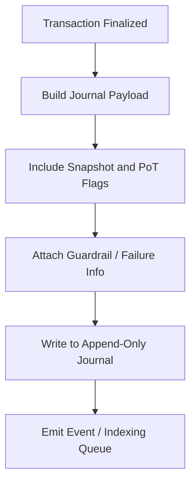

# tx_journal_writer.md

## Module: Transaction Journal Writer
- **Layer**: Processing Layer — AST (Aros Studio Tokenomics)
- **Status**: Production-grade
- **Author**: Aros Studio NodeChain Division
- **Last Updated**: 2025-07-05

---

## Overview

The `tx_journal_writer` module is responsible for creating immutable transaction-level logs for every state-changing or attempted transaction in the AST system. It captures structured metadata, results, and execution context into a durable ledger-compatible format, which is essential for auditability, rollback, replay, analytics, and forensic integrity.

This journal is **not** the main ledger — it is an **indexed, chronological mirror of transaction activity** with enhanced metadata and traceability markers.

---

## Purpose

- Store an exact, tamper-resistant log of every transaction’s lifecycle
- Capture validation results, execution outcomes, failure reasons, and system flags
- Provide input for compliance and audit engines
- Enable transaction replay or simulation based on archived state
- Support Proof of Transaction (PoT) trace injection

---

## What Gets Journaled

Each transaction record in the journal contains:

| Field                   | Description                                                  |
|-------------------------|--------------------------------------------------------------|
| `tx_id`                | Unique identifier of the transaction                          |
| `timestamp`            | Batch-level or wallclock timestamp of processing              |
| `status`               | One of: `validated`, `rejected`, `executed`, `rolled_back`    |
| `execution_node`       | Node ID that handled the transaction                          |
| `snapshot_id`          | Reference to the state snapshot used                          |
| `emission_ready`       | Boolean — marked true if PoT can be triggered                 |
| `flags`                | Execution or failure flags set during processing              |
| `failure_code`         | If applicable — standardized failure reason                   |
| `risk_score`           | Calculated trust score at time of processing                  |
| `hash_preimage`        | Input data used to generate PoT hash                          |
| `guardrail_action`     | If guardrail was triggered, action taken                      |
| `simulation_used`      | Boolean — whether `tx_simulation_mode` was engaged            |
| `trace_flag`           | Boolean — if journal entry should be prioritized in review    |

---

## Sample Journal Entry

```json
{
  "tx_id": "TX-9183-AST",
  "timestamp": 1720250401,
  "status": "executed",
  "execution_node": "ND-11",
  "snapshot_id": "SS-2038",
  "emission_ready": true,
  "flags": ["PoT_attached", "risk_score_high"],
  "failure_code": null,
  "risk_score": 0.33,
  "hash_preimage": "0x293abf...21cc",
  "guardrail_action": "none",
  "simulation_used": false,
  "trace_flag": true
}

```

---

## Lifecycle Integration

1. Transaction completes validation
2. Snapshot context is finalized
3. Dispatch or rollback completes
4. Journal Writer receives final state
5. Record is written into append-only journal database
6. Optional event emitted to indexing / alert systems

---

## Mermaid Diagram



---

## Failure Journaling

If transaction is rejected or fails mid-execution:

- Journal entry still created
- Status set to `rejected` or `rolled_back`
- `failure_code` and `trace_flag = true` must be present
- Allows tracking of failure patterns over time

---

## Data Integrity

- All journal entries are:
    - **Hash-chained** per node
    - **Digitally signed** using node’s private key
    - **Immutable** once appended
- Journal supports Merkle proofs for external validation

---

## Query Interface

The journal supports internal and external querying by:

- `tx_id`
- `status`
- `date range`
- `risk score > x`
- `trace_flag = true`
- `failure_code = X`

Supports export to analytics layer or forensic vault.

---

## Dependencies

| Module | Role in Journal Writing |
| --- | --- |
| `tx_state_snapshot_hook` | Provides consistent state reference |
| `tx_failure_modes` | Supplies failure codes and messages |
| `tx_execution_guardrails` | Adds guardrail action tags |
| `PoT_Attestation_Engine` | Embeds PoT flags and hash lineage |
| `tx_dispatch_engine` | Signals completion or abort of transaction |

---

## Developer Notes

- All journal records are versioned
- Schema updates must be backward-compatible
- Journal is designed to run on a separate I/O channel to avoid blocking TX flow
- Test suites must verify:
    - Determinism of logs
    - Failure vs success branching
    - Hashchain consistency

---

## Version History

| Version | Date | Changes |
| --- | --- | --- |
| 1.0 | 2025-07-05 | Initial release |

---
