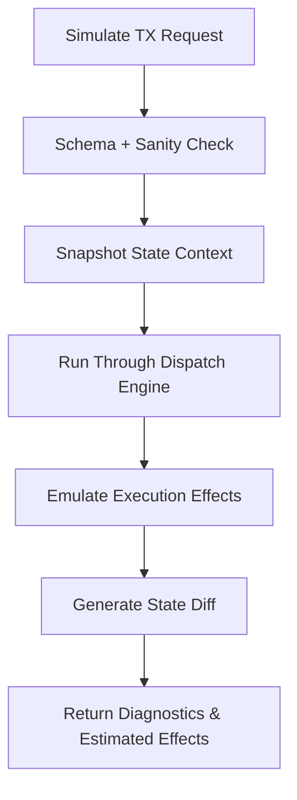

# tx_simulation_mode.md

## Module: Transaction Simulation Mode
- **Layer**: Processing Layer — AST (Aros Studio Tokenomics)
- **Status**: Production-grade
- **Author**: Aros Studio NodeChain Division
- **Last Updated**: 2025-07-05

---

## Overview

The `tx_simulation_mode` module introduces an isolated transaction execution path designed to simulate the effects of a transaction without committing it to the ledger. It is a deterministic, read-only, side-effect-free subsystem that allows validation, risk estimation, gas prediction, and system behavior testing prior to actual transaction execution.

Simulation Mode is essential for:

- **Pre-validation analysis**
- **Risk mitigation**
- **User transparency before final confirmation**
- **Auditing/QA pipelines**
- **Dynamic feedback for frontend interfaces**

It operates fully integrated with the AST processing framework and can be triggered by internal policy logic or external API requests.

---

## Trigger Conditions

The simulation pipeline is triggered under the following conditions:

- Upon explicit request via API (e.g. `/simulate_tx`)
- If a transaction fails preliminary validation and is redirected to dry-run path
- If the user toggles "preview execution" on wallet interface
- During AI risk analysis phase before committing high-value transactions
- As part of rollback-testing and audit simulations

---

## Simulation Characteristics

| Property            | Value                             |
|---------------------|-----------------------------------|
| Commit to ledger    | ❌ No                             |
| Mutate state        | ❌ No                             |
| Deterministic       | ✅ Yes                            |
| Generates gas usage | ✅ Yes (estimated)                |
| Emits events        | 🔄 Simulated events only          |
| Affects PoT         | ❌ No                             |
| Logs stored         | ✅ Yes (marked `simulated=true`)  |

---

## Workflow

1. Transaction submitted to Simulation API
2. Sanity and schema checks performed
3. Transaction context cloned from `tx_state_snapshot_hook`
4. Execution path emulated through dispatch engine
5. Virtual state diff generated (but not applied)
6. Result and diagnostics returned to requester

---

## Mermaid Diagram



---

## Input Format (API Request)

```json
{
  "simulate": true,
  "transaction": {
    "tx_id": "TX-SIM-9138",
    "sender": "0xA312...",
    "recipient": "0xB873...",
    "amount": 40.5,
    "token_id": "AROS-002",
    "timestamp": 1720248901,
    "signature": "BASE64-ENCODED"
  }
}

```

---

## Output Format (Simulation Response)

### Success

```json
{
  "tx_id": "TX-SIM-9138",
  "simulated": true,
  "status": "success",
  "gas_estimate": 2910,
  "state_diff": {
    "sender_balance": -40.5,
    "recipient_balance": +40.5
  },
  "risk_score": 0.12,
  "events_emitted": ["Transfer"]
}

```

### Failure

```json
{
  "tx_id": "TX-SIM-9138",
  "simulated": true,
  "status": "error",
  "error": {
    "code": "INSUFFICIENT_BALANCE",
    "message": "Sender does not have enough balance"
  }
}

```

---

## Internal Dependencies

- `tx_dispatch_engine`
- `tx_execution_contexts`
- `tx_state_snapshot_hook`
- `tx_audit_log_format`
- `tx_failure_modes`

---

## Key Use Cases

- **User Preview Mode**: Wallet interfaces may preview transaction impact before committing.
- **AI Risk Analysis**: Simulation used as input layer for AI-based transaction validators.
- **Policy Triggered Simulation**: System may simulate large or outlier transactions automatically.
- **Rollback Confidence**: Ensures that rollback strategy will behave correctly before applying actual revert.
- **Testing & QA Pipelines**: DevOps tools may simulate batches of transactions for staging environments.

---

## Security Considerations

- Simulated transactions are tagged in logs and **cannot be replayed** or submitted to the ledger.
- No private keys are required; signatures are verified but not used to authorize state changes.
- Simulation operates on ephemeral, cloned state layers — **read-only context**.
- Simulation results must **never be treated as authorization** for execution.

---

## Audit Tags

All simulation outputs must include the following metadata:

```json
{
  "metadata": {
    "simulated": true,
    "timestamp": 1720248901,
    "validator_node": "N-0011",
    "source_ip": "198.51.100.19"
  }
}

```

---

## Versioning

| Version | Date | Notes |
| --- | --- | --- |
| 1.0 | 2025-07-05 | Initial implementation |

---
