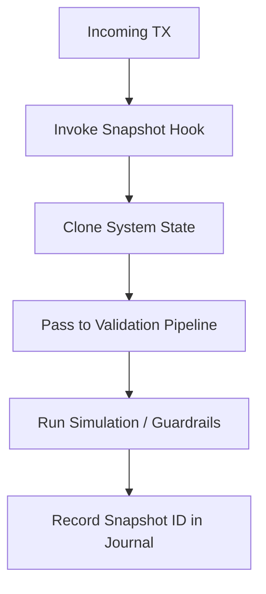

# tx_state_snapshot_hook.md

## Module: Transaction State Snapshot Hook
- **Layer**: Processing Layer — AST (Aros Studio Tokenomics)
- **Status**: Production-grade
- **Author**: Aros Studio NodeChain Division
- **Last Updated**: 2025-07-05

---

## Overview

The `tx_state_snapshot_hook` module provides a transactional read-only capture of the current system state at the moment of validation or execution preparation. It ensures that every transaction is evaluated against a consistent, immutable snapshot of the state tree, avoiding race conditions, unintended side-effects, or non-determinism across nodes.

This hook is fundamental to preserving determinism and reproducibility within AST’s zero-trust architecture.

---

## Purpose

- Lock a **read-only clone** of the current ledger and token state
- Provide a consistent baseline for:
  - Validation pipeline evaluation
  - Simulation mode dry-runs
  - Guardrail enforcement
  - Fee Distribution eligibility logic
- Enable external and internal consistency checks without mutation
- Support rollback comparison (before/after diffs)

---

## How It Works

1. Transaction enters the validation pipeline
2. `tx_state_snapshot_hook` is invoked
3. System forks a deterministic, immutable view of:
   - Account balances
   - Token metadata
   - Lock/freeze statuses
   - Risk scores and trust models
   - Node time context
   - Execution policy state
4. This snapshot is passed into downstream modules for isolated computation

---

## Data Structure (Snapshot Schema)

```json
{
  "snapshot_id": "SS-9841-AST",
  "timestamp": 1720249900,
  "node_id": "AST-ND-11",
  "accounts": {
    "0xA1B3...": {
      "balance": 190.25,
      "frozen": false,
      "risk_score": 0.07
    },
    "0xB3E9...": {
      "balance": 422.00,
      "frozen": true,
      "risk_score": 0.43
    }
  },
  "tokens": {
    "AROS-001": {
      "supply": 7500000,
      "emission_limit": 10000000,
      "status": "active"
    }
  },
  "policy_context": {
    "region": "global",
    "execution_mode": "deterministic",
    "emission_epoch": 191,
    "allowed_nodes": ["ND-01", "ND-11", "ND-12"]
  }
}

```

---

## Key Guarantees

| Guarantee | Description |
| --- | --- |
| **Read-only** | Snapshot is immutable — cannot be modified by any downstream module |
| **Node-consistent** | Snapshot must be generated and hashed identically across validating nodes |
| **Epoch-stable** | Snapshot is locked to current emission epoch during transaction flow |
| **Rollback-usable** | Can be stored to assist in rollback diff comparisons |

---

## Integration Flow

- `tx_validation_pipeline` uses snapshot for rule evaluation
- `tx_simulation_mode` runs execution on frozen state
- `tx_execution_guardrails` consults snapshot for real-time decisions
- `tx_journal_writer` logs snapshot reference per transaction
- External audit systems may verify transaction correctness against stored snapshot hashes

---

## Mermaid Diagram



---

## Snapshot Lifespan

- Snapshot is **ephemeral** unless:
    - Transaction is committed (then hash stored)
    - Transaction fails but triggers forensic logging
- Snapshots are stored **in-memory** or **ephemeral storage** with TTL (~10 minutes default)
- Admin nodes may configure snapshot TTL and storage thresholds via policy

---

## Failure Modes

| Condition | Response |
| --- | --- |
| Snapshot cloning fails | Reject transaction (code: `SNAPSHOT_ERROR`) |
| Snapshot hash mismatch | Invalidate node / fork alert |
| Memory pressure exceeds limit | Delay snapshot or trigger cleanup |

---

## Error Example

```json
{
  "tx_id": "TX-1037-EX",
  "status": "rejected",
  "error": {
    "code": "SNAPSHOT_ERROR",
    "message": "Unable to create deterministic snapshot at node AST-ND-11"
  }
}

```

---

## Security Considerations

- Snapshot hashes are signed by the local node and included in final TX hash tree
- Snapshots must be created using locked execution mutex to avoid concurrency
- External tools (auditors, forensic engines) may verify snapshot authenticity by recomputing hash and checking signature

---

## Version History

| Version | Date | Changes |
| --- | --- | --- |
| 1.0 | 2025-07-05 | Initial module implementation |

---
