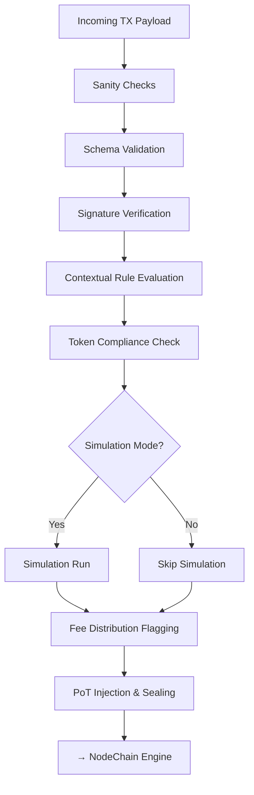

# tx_validation_pipeline.md

## Overview

The `tx_validation_pipeline` module is a critical part of the AST (Aros Studio Tokenomics) Processing Layer. It defines the full lifecycle of validation that each transaction undergoes before being accepted into the execution flow. The pipeline enforces system-wide integrity, security guarantees, and rule compliance as defined by the AROS tokenomics model, Proof of Transaction protocol, and associated emission logic.

Transactions entering the AST system must be validated not only structurally but also behaviorally — including time constraints, user eligibility, context-bound logic, and eventual readiness for emission processing.

---

## Pipeline Structure

The validation process is executed in a **multi-stage pipeline**, consisting of the following stages:

1. **Stage 0: Input Sanity Checks**
2. **Stage 1: Schema and Structure Validation**
3. **Stage 2: Signature & Identity Verification**
4. **Stage 3: Contextual Rule Evaluation**
5. **Stage 4: Token Compliance Evaluation**
6. **Stage 5: Simulation Integrity Test (optional)**
7. **Stage 6: Fee Distribution Readiness Flagging**
8. **Stage 7: PoT Injection and Sealing**

---

## Stage Descriptions

### Stage 0: Input Sanity Checks

- Ensures the transaction payload is non-null, JSON-formatted, and meets base entry criteria.
- Invalid payloads are immediately rejected.
- Critical for attack prevention via malformed or nullified payloads.

```json
{
  "tx_id": "0001-abcde",
  "payload": { ... },
  "signature": "BASE64...",
  "timestamp": 1720248390
}
```

---

### Stage 1: Schema and Structure Validation

- Confirms internal schema compliance against the transaction format defined in `tx_structure_and_metadata`.
- Verifies field presence, types, nesting, and allowed ranges.
- Any missing or malformed fields trigger an error response.

Errors raised:
```json
{
  "error": "INVALID_FIELD_FORMAT",
  "field": "sender_wallet"
}
```

---

### Stage 2: Signature & Identity Verification

- Verifies sender authenticity via digital signature matching using elliptic curve cryptography (ECC).
- Signature must match sender's public key stored on-chain or in the associated address registry.
- Rejection occurs if identity spoofing or signature mismatch is detected.

---

### Stage 3: Contextual Rule Evaluation

- Pulls current system-wide state snapshot (`tx_state_snapshot_hook`) and executes evaluation against:
  - Quota limits
  - Time-locked conditions
  - Jurisdictional policies (if applicable)
  - Risk score thresholds

This step may invoke `tx_execution_guardrails` if a high-risk condition is triggered.

---

### Stage 4: Token Compliance Evaluation

- Validates:
  - That tokens involved are not locked or frozen.
  - Transaction does not breach supply ceilings.
  - Allocation constraints are enforced per current policy.

Violations result in errors like:
```json
{
  "error": "TOKEN_FROZEN_OR_EXPIRED",
  "token_id": "AROS-0021"
}
```

---

### Stage 5: Simulation Integrity Test (Optional)

- Engages `tx_simulation_mode` to run the transaction in an isolated dry-run.
- If simulation result deviates from expected output (as per policy), the transaction is flagged or rejected.

---

### Stage 6: Fee Distribution Readiness Flagging

- If all prior stages succeed, the transaction is marked with a metadata flag:
```json
{
  "tx_flags": {
    "ready_for_emission": true,
    "validated": true
  }
}
```
- This status is required for PoT attestation to proceed.

---

### Stage 7: PoT Injection and Sealing

- Final injection of PoT (Proof of Transaction) metadata into transaction hash.
- This includes:
  - Validator node ID
  - Timestamp of attestation
  - Local validator risk score
  - NodeChain reference

Resulting hash is then forwarded to `NodeChain_Fee Distribution_Engine`.

---

## Mermaid Diagram



---

## Error Codes Reference

| Code                    | Meaning                                  |
|-------------------------|------------------------------------------|
| INVALID_FIELD_FORMAT    | Field is malformed or has wrong type     |
| MISSING_REQUIRED_FIELD  | Essential field is not present           |
| SIGNATURE_VERIFICATION_FAILED | Digital signature is invalid       |
| INSUFFICIENT_PERMISSIONS | Transaction not allowed in current state |
| TOKEN_FROZEN_OR_EXPIRED | Token cannot be used at this time        |
| SIMULATION_FAILED       | Simulation output violates expected result |

---

## Interfaces

### Input
```json
{
  "tx_id": "TX-9137-A",
  "sender": "0x1a83…",
  "recipient": "0x2bb1…",
  "amount": 120.5,
  "token_id": "AROS-001",
  "signature": "BASE64-ENCODED",
  "timestamp": 1720222000
}
```

### Output (success)
```json
{
  "tx_id": "TX-9137-A",
  "validated": true,
  "flags": {
    "ready_for_emission": true
  }
}
```

### Output (failure)
```json
{
  "tx_id": "TX-9137-A",
  "validated": false,
  "error": {
    "code": "TOKEN_FROZEN_OR_EXPIRED",
    "message": "Token cannot be used for transfers"
  }
}
```

---

## Dependencies

This module directly integrates with:

- [`tx_structure_and_metadata`](./tx_structure_and_metadata.md)
- [`tx_state_snapshot_hook`](./tx_state_snapshot_hook.md)
- [`tx_execution_guardrails`](./tx_execution_guardrails.md)
- [`tx_simulation_mode`](./tx_simulation_mode.md)
- `PoT_Attestation_Engine` (external)
- `NodeChain_Fee Distribution_Engine` (downstream)

---

## Security Considerations

- All validation stages are immutable once passed — rollback requires restart.
- Audit logs generated at each stage (see `tx_audit_log_format.md`).
- All failures are logged and hashed for integrity.

---

## Author

- **Module Owner**: AST Core Team  
- **Maintained By**: Aros Studio NodeChain Division  
- **Last Updated**: 2025-07-05

```
